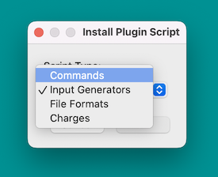
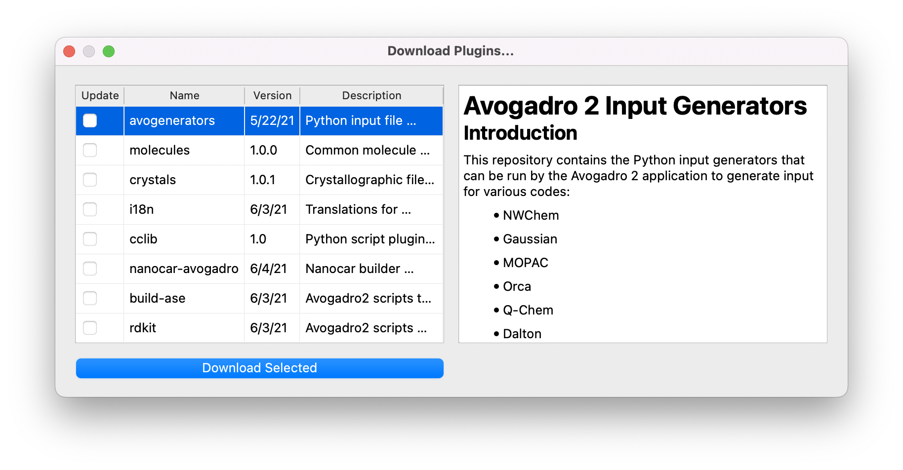

(develop-scripts)=

# Pre-2.0 Plugin API

Avogadro can be extended easily using Python scripts:

- [charges / electrostatics](charges)
- [menu commands](commands)
- [energy / force fields](energy)
- [file formats](formats)
- [input generators](generators)

More script types are anticipated in the future, including:

- plotters
- web databases
- custom colors

Suggestions either for new types of scripts or new functions are always welcome.

Scripts can either be installed manually, by dragging to the Avogadro window:



Scripts can also be installed from GitHub repositories through the "Download Plugins…" command:



```{toctree}
---
hidden: true
---
install
interface
charges
commands
energy
formats
generators
```
