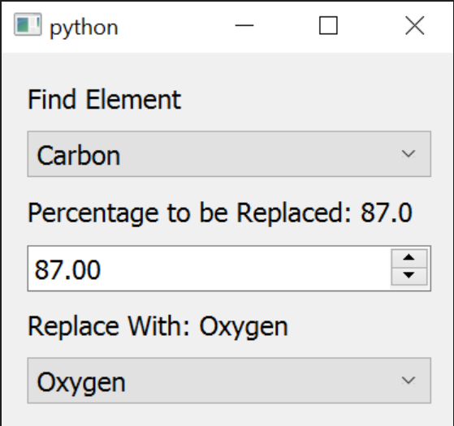

# Example Plugin Script - Part 1
Let's consider [Alloy/Alchemy command](https://github.com/OpenChemistry/avogadro-commands/blob/master/replace.py) as a reference for writing code for scripts or plugins

## The Main function:
The `main` function is responsible for parsing command-line arguments . It serves as the entry point for the script , facilitates its interaction with the user and executes the appropriate actions. 

Below is a detailed explanation of the `main` function:

```python
if __name__ == "__main__":
    parser = argparse.ArgumentParser('Replace atoms of elements')
    parser.add_argument('--debug', action='store_true')
    parser.add_argument('--print-options', action='store_true')
    parser.add_argument('--run-command', action='store_true')
    parser.add_argument('--display-name', action='store_true')
    parser.add_argument('--menu-path', action='store_true')
    parser.add_argument('--lang', nargs='?', default='en')
    args = vars(parser.parse_args())

    debug = args['debug']

    if args['display_name']:
        print("Replace Elements")
    if args['menu_path']:
        print("&Build")
    if args['print_options']:
        print(json.dumps(getOptions()))
    elif args['run_command']:
        print(json.dumps(runCommand()))
```

Here's a detailed breakdown of the `main` function:

1. **Command-Line Argument Parsing**:
   The `argparse` module is used to define command-line arguments and parse them.

2. **Script Entry Points**:
   - The script supports the following command-line arguments (Refer [script entry points](https://two.avogadro.cc/scripts/commands.html#script-entry-points)) :
     - `--debug`
     - `--print-options`
     - `--run-command`
     - `--display-name`
     - `--menu-path`
     - `--lang [language]`


3. **Debug Mode**:
   If the `--debug` flag is set, the `debug` variable is set to `True`. This can be used to control the script's debugging behavior.

 ### Input Arguments  

1. **Display Name**:
   If the `--display-name` flag is provided, the script prints ``Replace Elements`` as the display name of the operation.

2. **Menu Path**:
   If the `--menu-path` flag is provided, the script prints ``&Build`` as the menu path where the operation can be found.
2. **Print Options**:
   If the `--print-options` flag is set, the script prints the available user [UI options](https://two.avogadro.cc/scripts/commands.html#specifying-ui-options-with-print-options) in JSON format using the `getOptions` function.

7. **Run Command**:
   If the `--run-command` flag is set, the script executes the `runCommand` function, which performs the element replacement operation and returns the modified molecular structure in JSON format.

##  getOptions() Function
```python
def getOptions():
    userOptions = {}

    userOptions['Find'] = {}
    userOptions['Find']['label'] = 'Find Element'
    userOptions['Find']['type'] = 'stringList'
    userOptions['Find']['values'] = list(element_dict.keys())
    userOptions['Find']['default'] = "Carbon"

    .....
    return opts
```
The getOptions function is used to specify the [script Interfaces](https://two.avogadro.cc/scripts/inte**rface.html#script-interfaces) or **the pop-up menu** for the script. For each option in the userOptions list, Avogadro will create appropriate labels, menus, text boxes, check boxes, etc.
Interface will look something like this:



It is called in the command line when `--print-options` is given as the input argument. 

