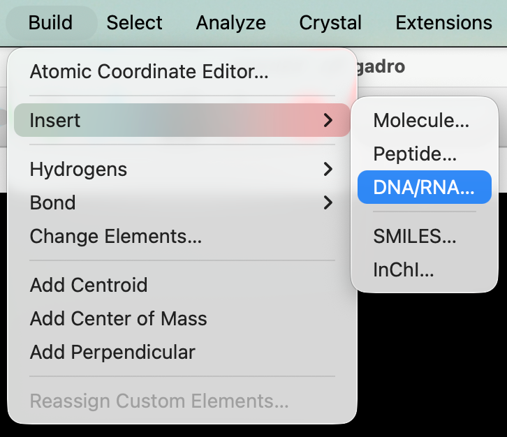
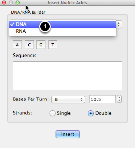
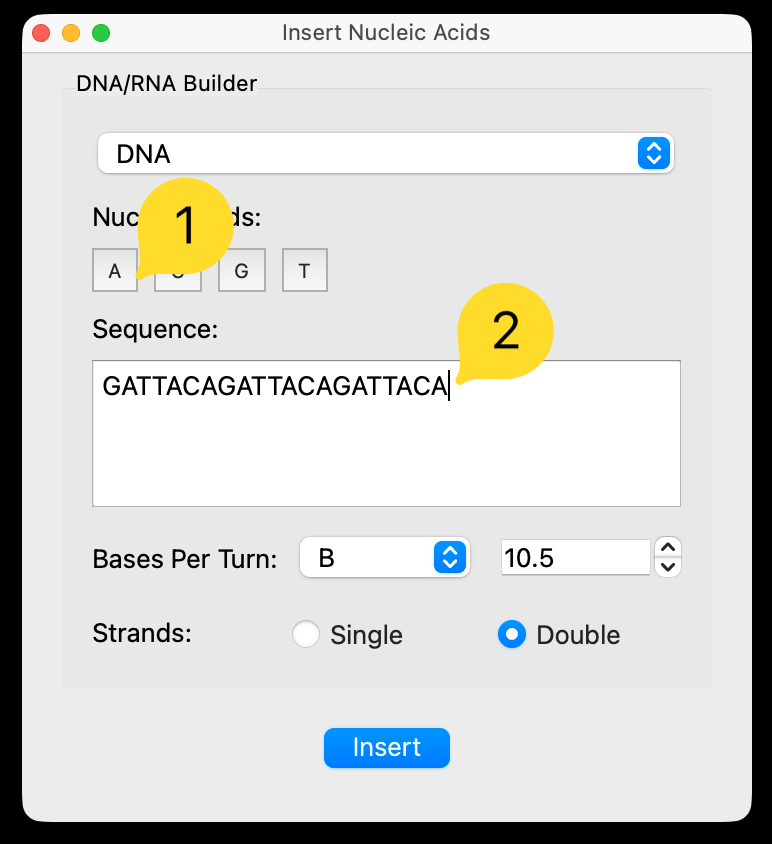
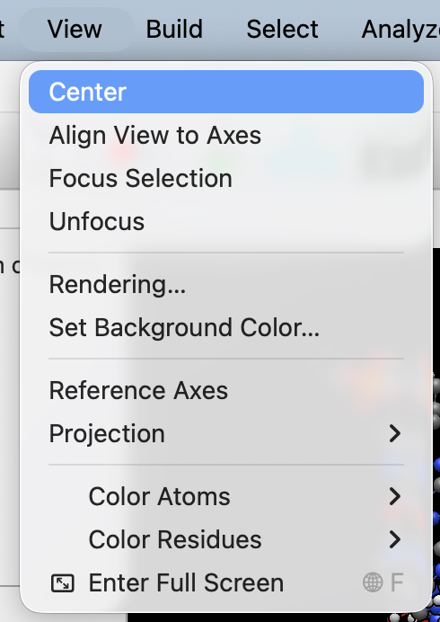
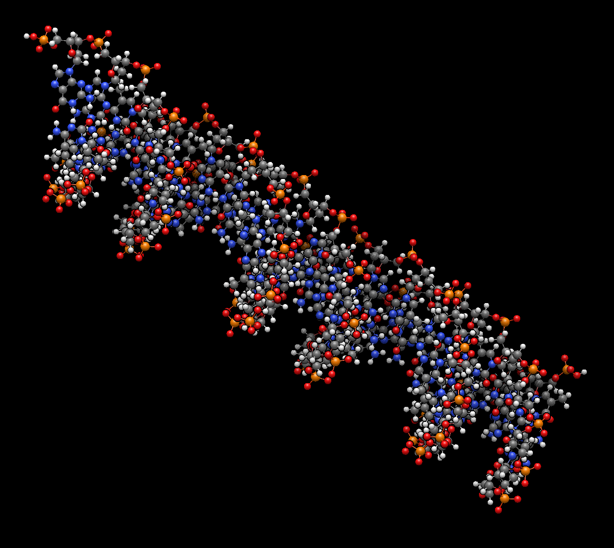

(building-molecules-dna)=

# Building DNA or RNA

Avogadro has a builder for nucleic acid sequences and this walk-through will show you how to use it.

The DNA/RNA builder is under the "Build" menu and "Insert" submenu.

Select either DNA or RNA \(1\) and the rest of the window will update accordingly.

You can also control the number of bases per turn as shown \(with defaults for A-DNA, B-DNA, Z-DNA, or RNA\).

You can enter the sequence either by clicking the buttons, or by typing the one-letter codes directly. For DNA sequences \(as shown here\), you can insert either single-stranded or double-stranded DNA.

You may wish to re-center the view or align the view to axes to see the whole molecule. If needed, switch to the [Navigate Tool](tools-navigation-tool)

There we go -- the well-known DNA double-helix!

## See Also

- {ref}`building-molecules-peptides` – Build peptide and protein sequences
- {ref}`building-molecules-pdb` – Import structures from the Protein Data Bank
- {ref}`tools-navigation-tool` – Rotate and pan the view
