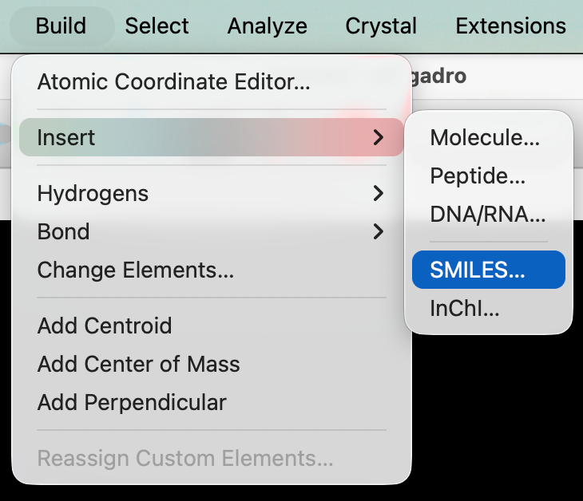
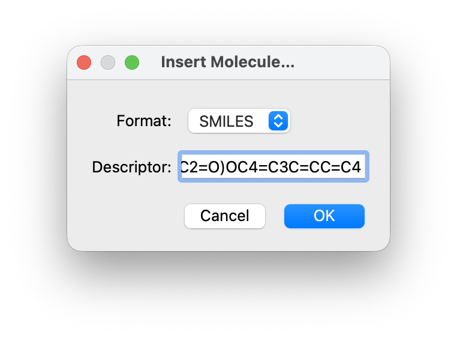

# Building with SMILES

SMILES \([Simplified Molecular-Input Line-Entry System](https://en.wikipedia.org/wiki/Simplified_Molecular_Input_Line_Entry_System)\) allows you to build molecules through a string of text. If you have a SMILES string \(e.g., copied from a paper or website\) or prefer to enter one for a complicated molecule, Avogadro will build a 3D geometry from the SMILES using [Open Babel](https://openbabel.org/)

SMILES is also a useful way to copy a molecule from a 2D chemical drawing program to insert into Avogadro.

Under the "Build" menu, hold your cursor over "Insert", and select "SMILES...".

Enter your SMILES fragment, and select "OK".

There it is..

