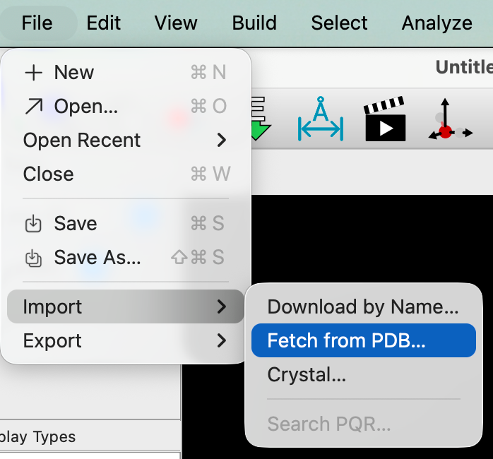
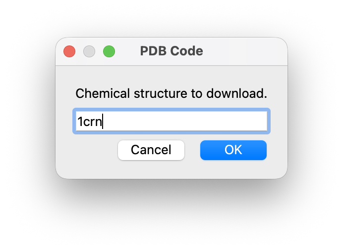
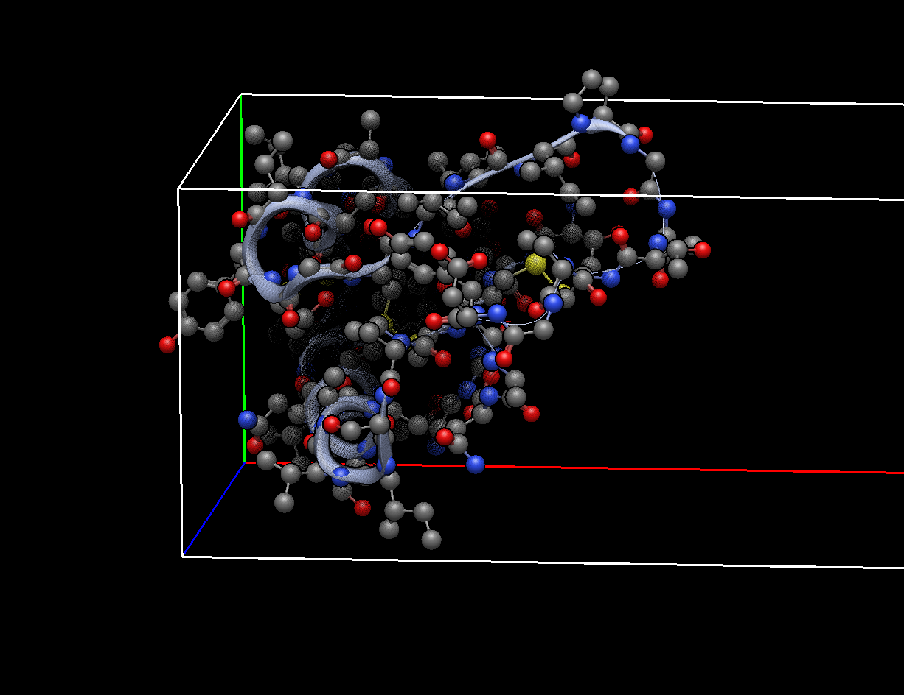
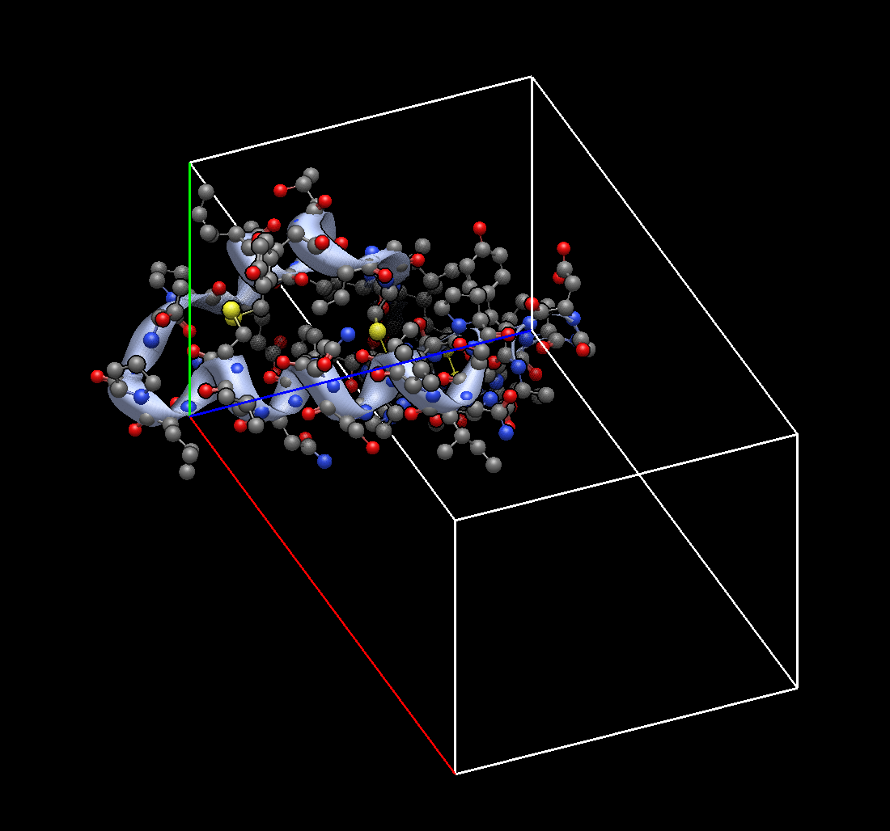
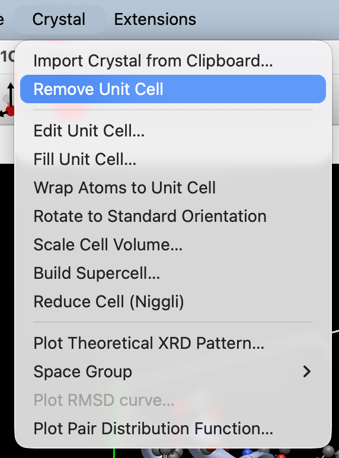

(building-molecules-pdb)=

# Importing from the Protein Data Bank \(PDB\)

You can read PDB files that you download yourself from [http://www.rcsb.org/](http://www.rcsb.org/) or access the PDB code yourself.

## Importing Directly

You can use File &gt; Import &gt; Fetch from PDB... to download proteins.

A dialog will come up and allow you to enter a PDB code \(e.g., 1CRN for crambin or 6vxx for the COVID spike protein\)

There it is... the PDB data direct from the website.

## Reading a Downloaded PDB file

If the direct import doesn't work, you can also use the website yourself. Go to [http://www.rcsb.org/](http://www.rcsb.org/) and select a protein, then download the "PDB File \(text\)" format of the file. From your downloads folder you can either drag and drop the file onto an Avogadro display screen, or drag and drop the file over the Avogadro application icon.

Dragging and dropping the file will open the PDB import with a unit cell \(Avogadro generally displays unit cells for all PDB imports\).

If the unit cell is unwanted, you can remove the unit cell under the "Crystal" menu by selecting "Remove Unit Cell".

