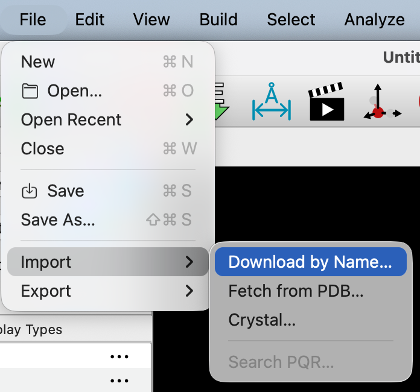

# Importing Molecules by Name

Select the "File" menu.

Then select "Import", and "Fetch by chemical name..."

A dialog box will pop up \(depicted below\), where you can type in any chemical name.

Avogadro will import the molecule into the viewing screen after you click "OK".

It may take a few seconds or even a minute to download the molecule online. Avogadro uses the NIH "Chemical Resolver" [http://cactus.nci.nih.gov/chemical/structure](http://cactus.nci.nih.gov/chemical/structure) to convert the name into a 3D molecular structure.

