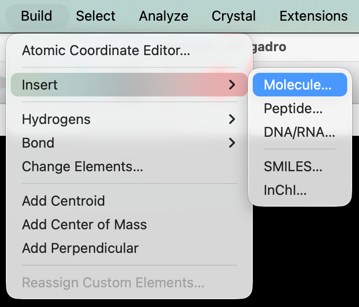
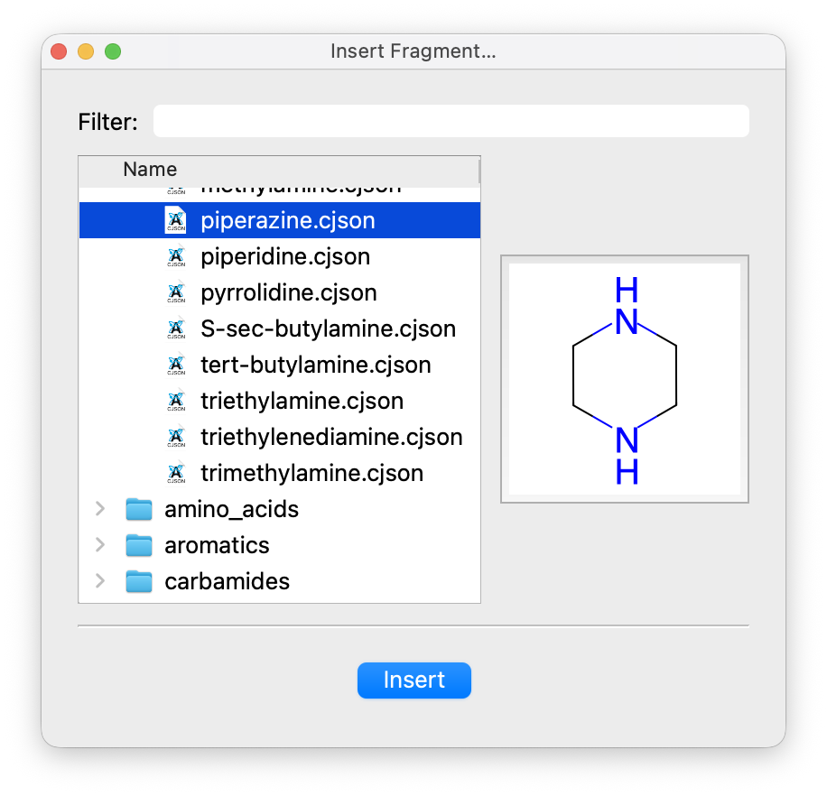
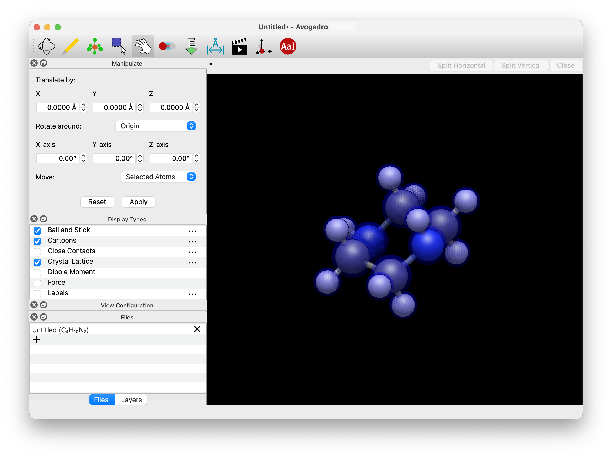

(building-molecules-fragments)=

# Insert Molecular Fragments

Avogadro includes over 400 common molecules and molecular fragments to make building larger structures easy. These molecules are always available even if you don't have a network connection or cannot [import by name](building-molecules-byname).

Under the "Build" menu, hold your cursor over "Insert", and then select "Fragment…".

A database of fragments will then pop up \(shown below\). You can filter the selection if need be. When you click on a particular fragment, a preview will appear:

After you've made your fragment selection, click "Insert".

The fragment will be inserted and the [Manipulate](tools-manipulate-tool) tool will be selected so you can move the new fragment around the window.

:::{tip}
Many of these fragments are also available through the [Template](tools-template-tool) tool to attach to hydrogen atoms.
:::

## See Also

- {ref}`tools-template-tool` – Attach functional groups and build metal complexes
- {ref}`building-molecules-smiles` – Build molecules from SMILES strings
- {ref}`building-molecules-byname` – Import molecules by chemical name
- {ref}`tools-manipulation-tool` – Move and position inserted fragments
