(display-types)=

# Display Types

Avogadro offers several display types to customize your molecular display
and offer high-quality publication-ready graphics.

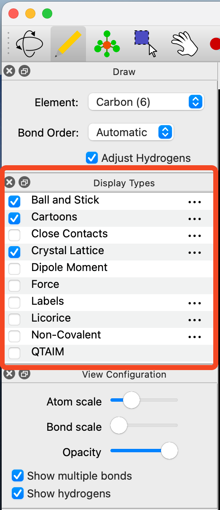

Clicking on the ⋯ icon located on the right of some display types will allow various adjustments to be made to the display. For example, you can edit the opacity of the Van der Waals Spheres so that you can still view the ball and stick model underneath.

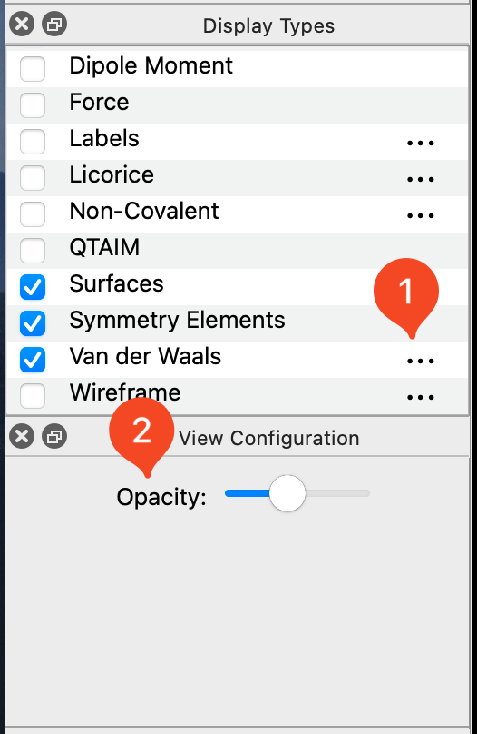

## Axes

Clicking on the Axes plugin will provide the cartesian axes of the molecule from the origin. Note that the red, green, and blue arrows represent the x, y, and z axes respectively.


## Ball and Stick

Ball and Stick is the default display style when Avogadro is opened. This  provides the standard ball and stick representation of a molecule.


## Cartoons

The cartoon feature only applies to secondary biological structures (e.g. α helix and β sheet). Below is the cartoon for hemoglobin.

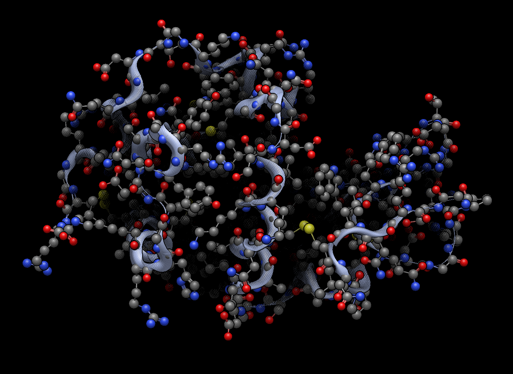

## Dipole

The Dipole plugin will display an overall net dipole if one is present.

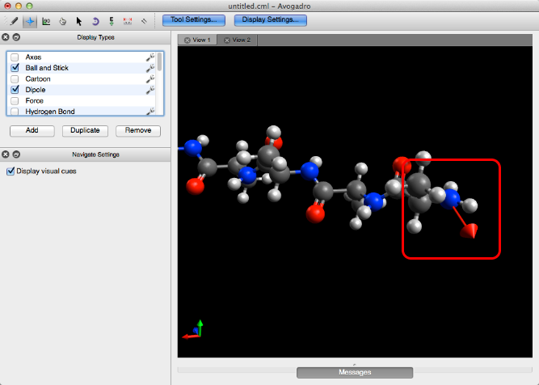

## Force

The Force plugin displays green arrows on atoms (as shown below), to qualitatively demonstrate the forces being applied to the atoms.

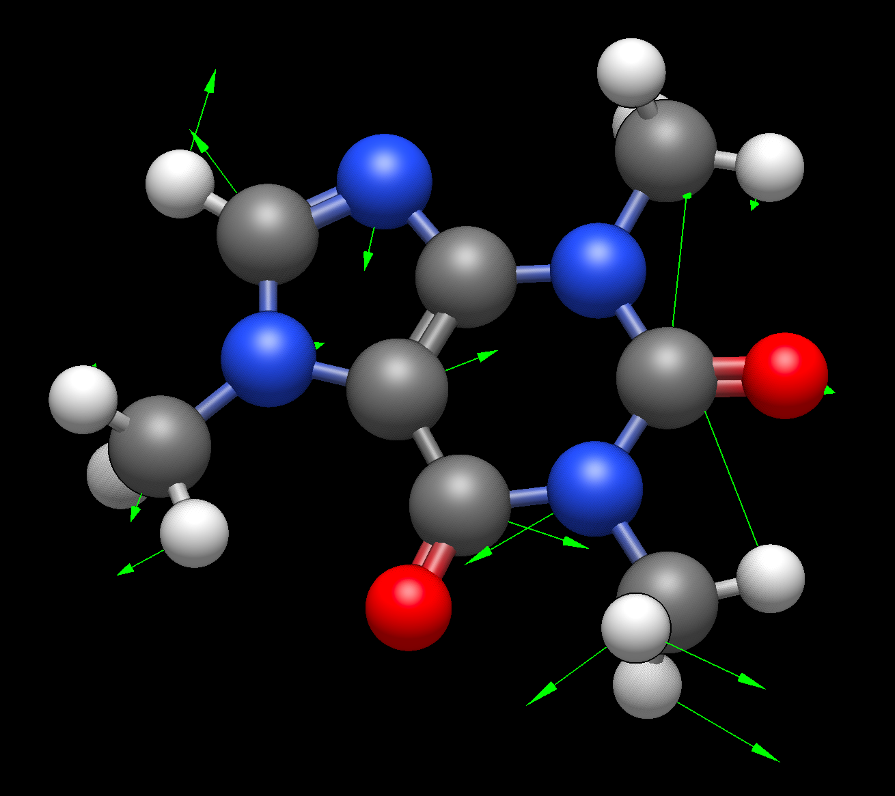

## Non-Covalent

The Non-Covalent style demonstrates implicit non-covalent interactions between atoms.

:::{versionadded} 2.0
In Avogadro 2, in addition to display of hydrogen bonds, the Non-Covalent style can show Halogen and Chalcogen bonds (e.g., S-S non-covalent interactions).
:::

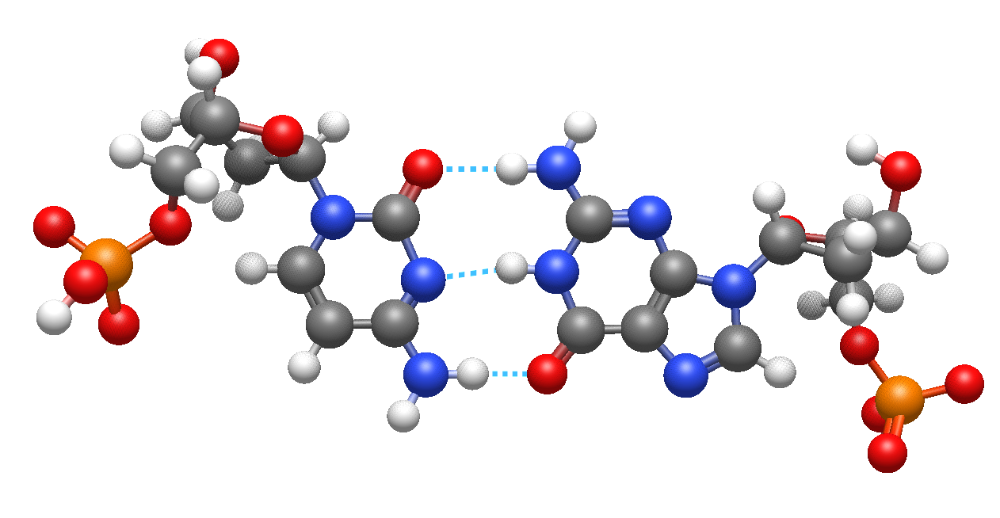

## Label

The label plugin numbers and labels all atoms present in a molecule.

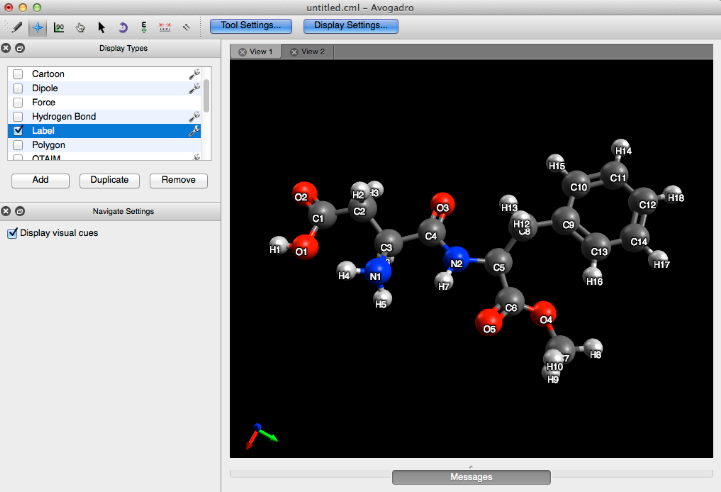

## QTAIM (Quantum Theory of Atoms in Molecules)

QTAIM displays the implicit bonding that is theorized to take place between the hydrogens of organic crystals (the implicit bonding is conveyed through dots). This display type is utilized by importing a .wfn file from the "QTAIM", "Molecular Graph" selection under the "Extensions" menu. More information can be found on this process in the Tutorial section of this manual.

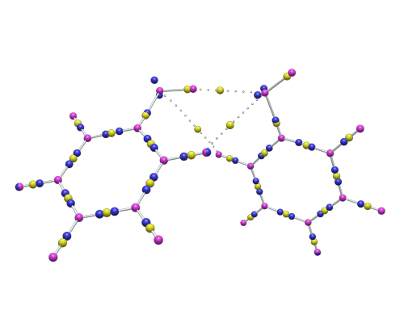

## Licorice

Licorice or "sticks" minimizes spheres for the atoms, instead drawing the covalent bond skeleton of the molecule.

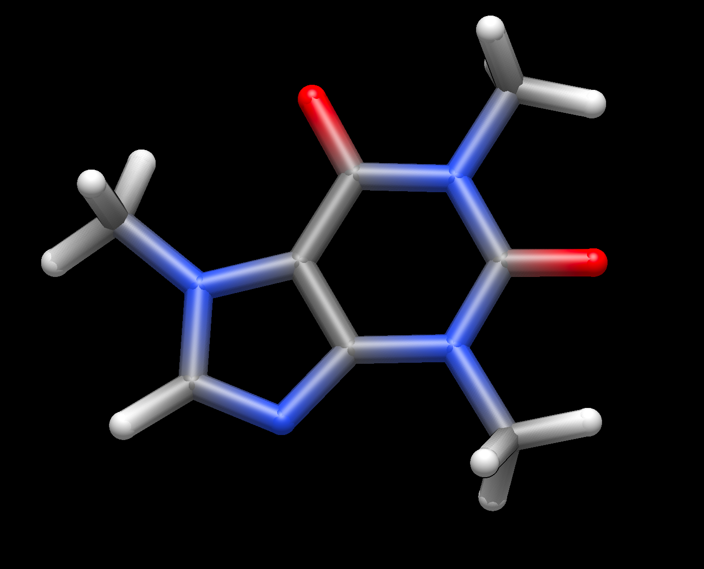

## Surfaces

Once a surface has been created (Extensions Menu -> Create Surfaces...), the Surface display type can be used. This display type allows adjustments to the orbital, opacity, rendering, style, and color.

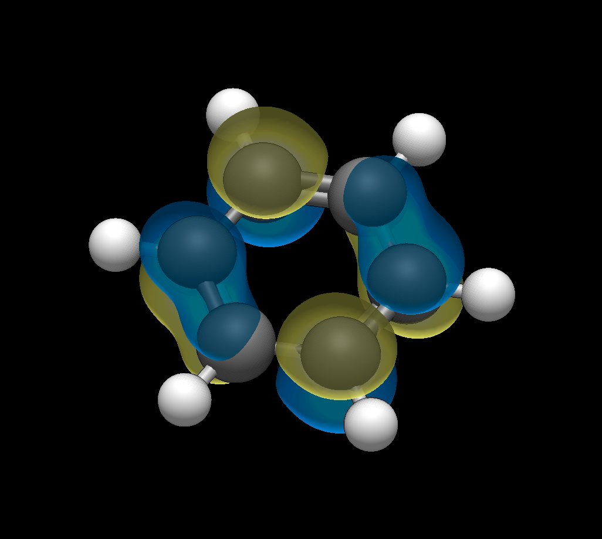

## Van der Waals Spheres

The Van der Waals plugin provides the classic sphere rendered Van der Waals image.

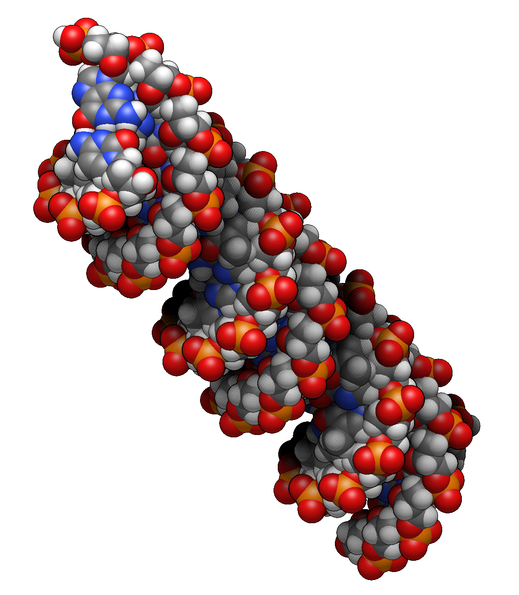

## Wireframe

Wireframe draws atoms and bond order into the molecule.

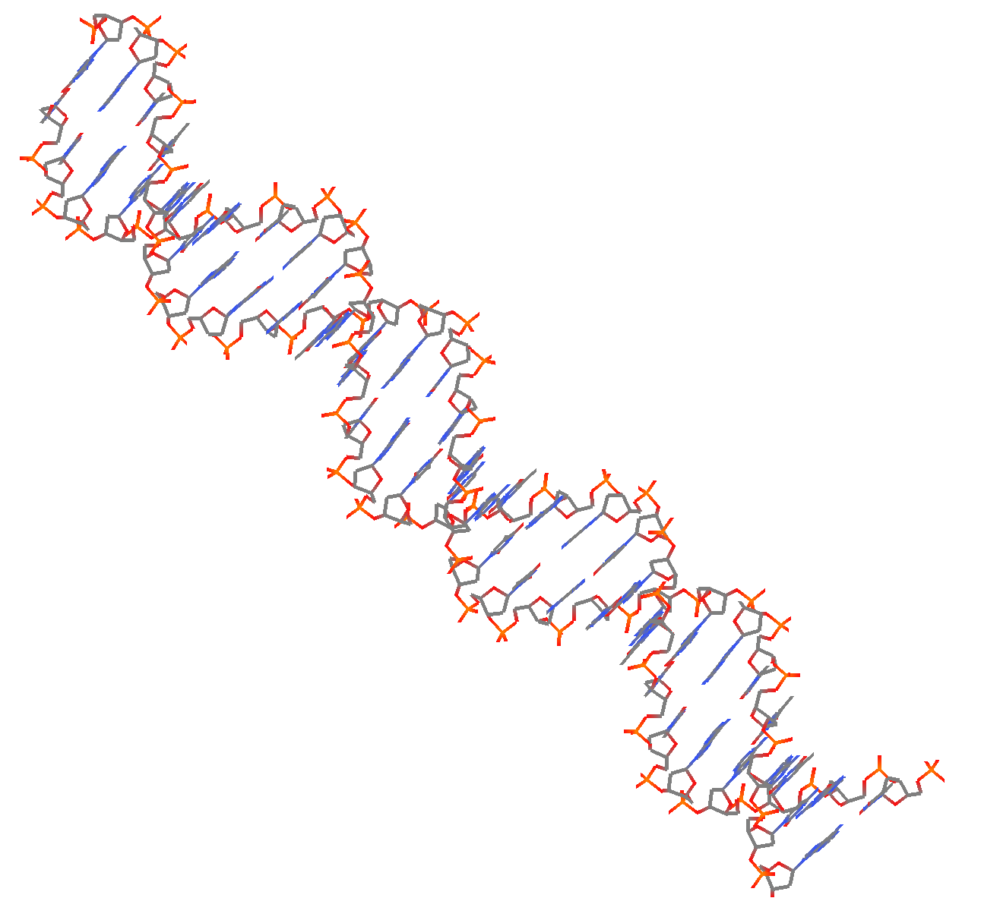

```{toctree}
---
caption: Display Types
---
Introduction <self>
coloring-molecules
```
