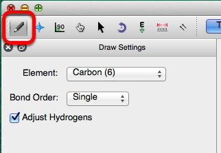
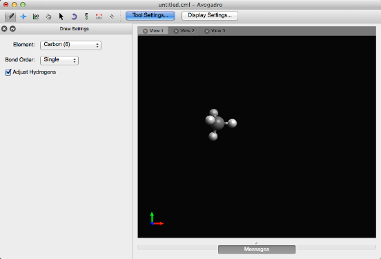
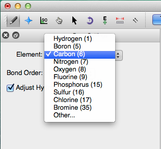
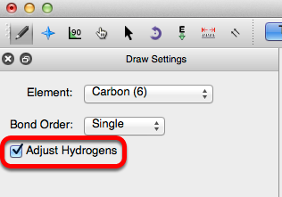

# Drawing Molecules

Molecules are built and edited with the draw tool.

<figure></figure>

Left clicking on the display will allow you to begin your journey into molecule creation. A left click will generate a carbon atom. A right click will delete the atom.

<figure></figure>

Left clicking the initial atom and dragging your mouse will generate a bond to another carbon atom.

<figure></figure>

Avogadro uses carbon as the default element. A different element can be selected through the "Element" drop down menu. Typing the atomic symbol (e.g., "O" for Oxygen, "A-s" for Arsenic) is a shortcut for changing the selected element.

<figure></figure>

Let's say you wanted to create water. You can either type in "O", or select "Oxygen (8)" from the drop down menu, and then click on the black display.

Left clicking on an atom that has already been generated will also change the element. In this case, clicking on the initial carbon atom changed it into an oxygen atom.

<figure></figure>

If the "Adjust Hydrogens" box is checked, hydrogen atoms in the molecule will be automatically adjusted to satisfy valency (as shown above).

<figure></figure>

Bond order is changed through the "Bond Order" drop down menu, or by typing the numbers "1", "2", or "3". Bonds are added by left clicking on a bond that has already been created. Right clicking on a bond deletes the bond, and the atom it's bonded to.

<figure></figure>

```{tip} **New in 2.0**
The default bond order is "Automatic," and will adjust with the length of the bond.
```

### Creating Carbon Dioxide

Begin drawing the "O-C-O" structure. After the structure is drawn, all you need to do is left click on the bonds. Left clicking on the bonds will create a double bond (shown below). 

<figure></figure>

Once you've created your molecule, you can optimize it's geometry through the extensions menu. Selecting the "Extensions" menu, and clicking "Optimize Geometry" will provide your molecule with proper bond lengths and angles.

<figure></figure>

You now know the basics of drawing a molecule in Avogadro!
