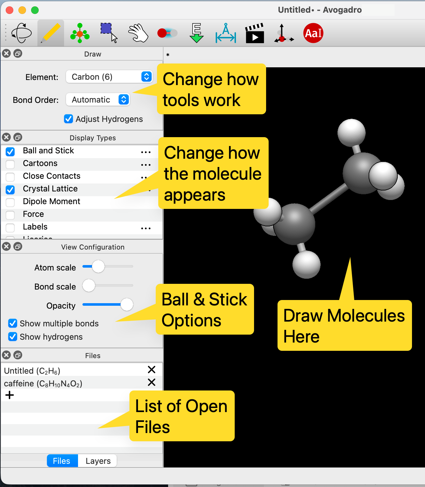
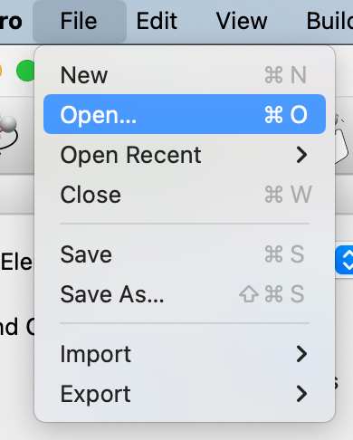
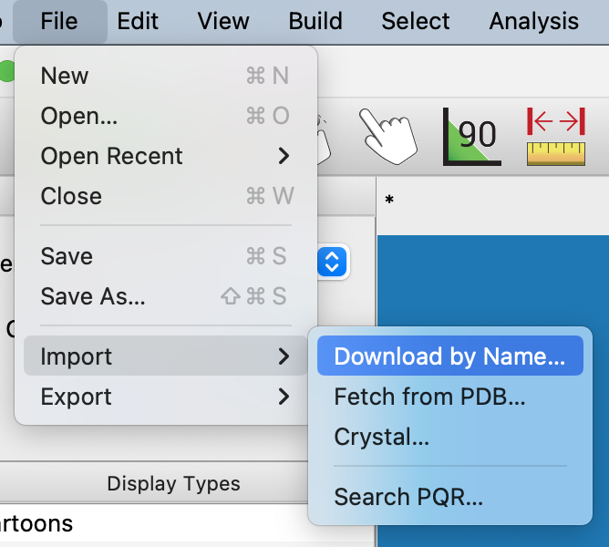
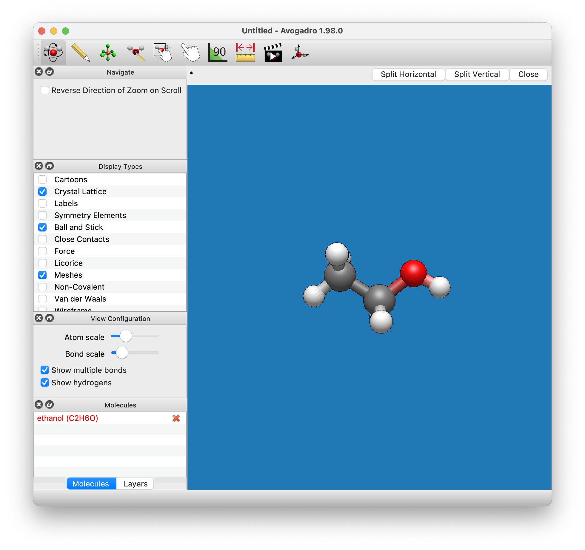

# Introduction

Avogadro is a "molecular editor," designed to be easy to use to construct and view molecules and materials in 3D. It runs on Windows, Linux, and Mac.

This manual was largely made on a Mac, but the interface should be very similar on any computer.

When you initially open Avogadro you will be presented with a screen such as the one shown below.

## Opening a File

The first thing you will probably want to do is open a file and navigate around the molecule. To do this click on the `File` menu and select `Open...`

You can then look through the files on your disk and find an appropriate chemical file. Thanks to [Open Babel](https://openbabel.org/), a large number of file types are supported including CML, XYZ, SDF, Mol2, PDB etc.

## Importing by Name

Avogadro also offers support to download molecules from online sources. One of the most useful is the "Import" then "Download by Name..." which uses the [NIH Chemical Resolver](https://cactus.nci.nih.gov/chemical/structure).

The screen shot shows the an ethanol file opened up and displayed using the default Ball and Stick display type. Notice that when a new file is opened Avogadro switches from the Draw Tool to the Navigate Tool, which allows you to view the molecule without editing it.

## Navigation

You can zoom in/out using the scroll wheel on your mouse or holding down the middle mouse button and moving the mouse cursor up/down. You can rotate the view by holding down the left mouse button and moving the mouse cursor. You can also translate the view by holding down the right mouse button and moving the mouse cursor.

Note: if your mouse only has one or two buttons you can also use the modifier keys \(shift and control\) along with the left mouse button to perform actions where you would normally use the middle or right mouse buttons respectively.
