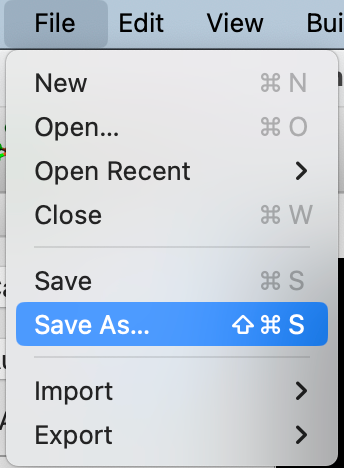
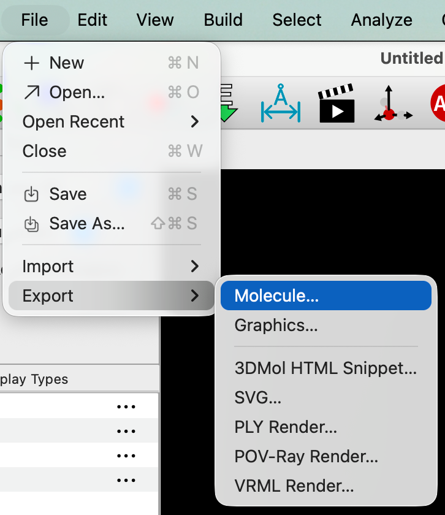

# Saving Files

By default, Avogadro saves files to its "native" format [CJSON](https://github.com/OpenChemistry/chemicaljson) (Chemical JSON), which stores as much chemical information as possible and is the recommended format. 



In particular, CJSON will retain atoms, bond orders, formal charges, unit cell parameters, space group information, surfaces, orbitals, vibrations and other spectra, selections, custom colors, etc.

CML (Chemical Markup Language) was the original save format for Avogadro and support is still retained.

## Exporting to other formats

If you wish to **export** to other formats (e.g., XYZ, PDB, SDF, etc.) use
`File`⇒`Export`⇒`Molecule…`



Avogadro uses support for [Open Babel](https://openbabel.org/) to write to over 100 different chemical file formats.

```{tip} **New in 2.0**
We separated the "export" to other formats into a new command because users would be surprised when saving to some formats (e.g., XYZ, PDB) and bond orders or other information would be lost.
```
