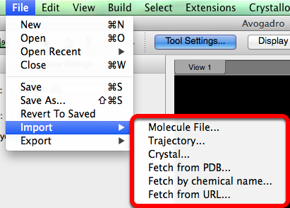

# File Menu

The file menu provides the standard abilities of creating a new file, opening & closing documents, as well as saving documents. It also yields the capability to import files from various databases.

## New

The "New" selection will open a new file in Avogadro.

## Open

After selecting "Open", a file that has previously been saved is accessible through the pop up browser.

## Open Recent

"Open Recent" displays a list of documents recently launched.

## Close

"Close" dismisses the window currently open.

## Save

"Save" will maintain your progress.

## Save As...

"Save As..." allows you to save progress without overwriting the original file.

## Revert to Saved

"Revert to Saved" will revert any changes made to the previously saved file.

## Import

"Import" will open chemical files stored in a database.

## Export

"Export" will make files created in Avogadro suitable for other programs.

