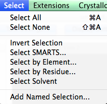
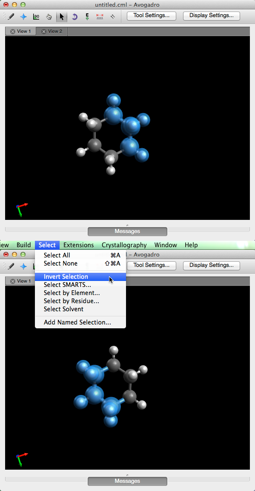
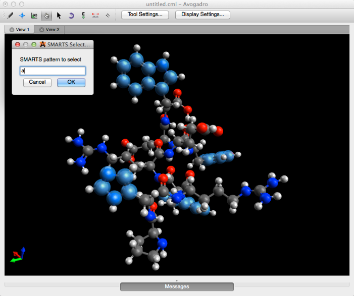

# Select Menu

The select menu makes chemical alterations more efficient through various modes of selection.

## Select All

"Select All" highlights everything in the display \(this feature can also be found under the "Edit" menu\).

## Select None

"Select None" will dismiss everything in the display \(this feature is also found under the "Edit" menu\).

## Invert Selection

"Invert Selection" reverses the selection made.

The first image displayed below is the orginal selection, and the second image demonstrates the inverted selection.

## Select SMARTS...

SMARTS **\(**SMiles ARbitrary Target Specification\) is a more general chemical language extension of SMILES. "Select SMARTS..." allows you to use this chemical language to select various atoms, or groups of atoms within the molecule. For example, typing "a" into the dialog box and clicking ok will select all atoms with aromaticity. More information can be found at the [Daylight SMARTS webpage](http://www.daylight.com/dayhtml/doc/theory/theory.smarts.html).

## Select by Element...

"Select by Element..." generates a periodic table pop up screen that allows you to select an element throughout the viewing display.

## Select by Residue...

"Select by Residue..." generates a pop up screen that allows you to select residues with specified names. For example, typing in "ALA" \(this feature is case sensitive\) to select an alanine residue.

This feauture only works with residues that were made using the peptide builder.

## Select Solvent

This feature will select "HOH" residues in PDB \(protein data bank\) files.

## Add Name Selection...

"Add Name Selection..." allows you to add a new selection to the current data base, which you can then recall at your convenience.

