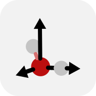
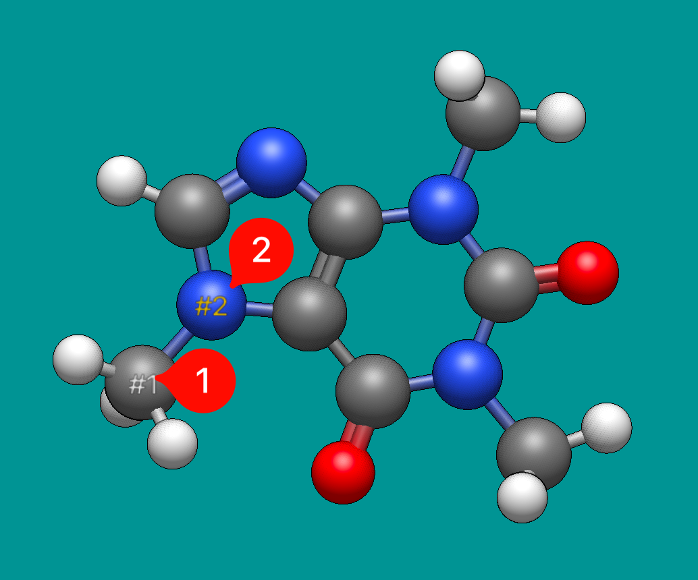
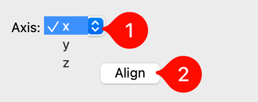

(tools-align-tool)=

# Align Tool



The **Align Tool** is used to rotate and translate the current molecule so that it aligns with one of the Cartesian axes.

## Basic Usage

First, an alignment axis is chosen from the **Axis** drop-down menu in the **Align** pane.
The <kbd>x</kbd>, <kbd>y</kbd>, and <kbd>z</kbd> keys on the keyboard are shortcuts for changing the alignment axis.

Secondly, select either one or two atoms in the view pane with the left mouse button.
The labels "#1" and "#2" will be displayed on each.

Clicking **Align** will then reposition the molecule as desired.

If only one atom was selected, the molecule will simply be translated so that it is placed at the origin (i.e. the Cartesian coordinates (0,0,0)).

If two atoms were selected, the first will be placed at the origin, and the second will be placed along the chosen axis.



```{tip}
The red axis is designated as the X axis, green is designated as the Y axis, and blue is designated as the Z axis.
```

## Options

The **Axis** drop-down menu allows you to choose which Cartesian axis the molecule will be aligned to.



