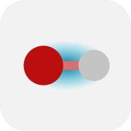
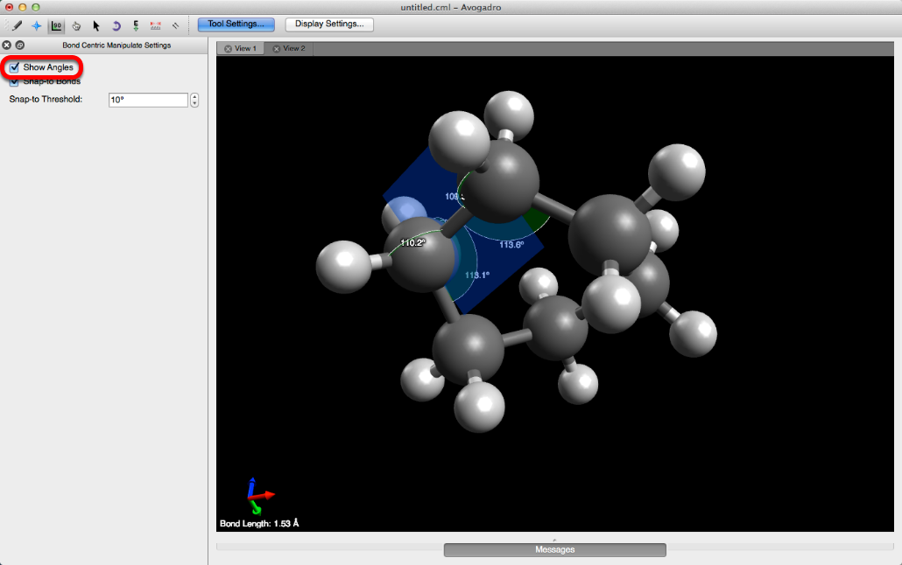
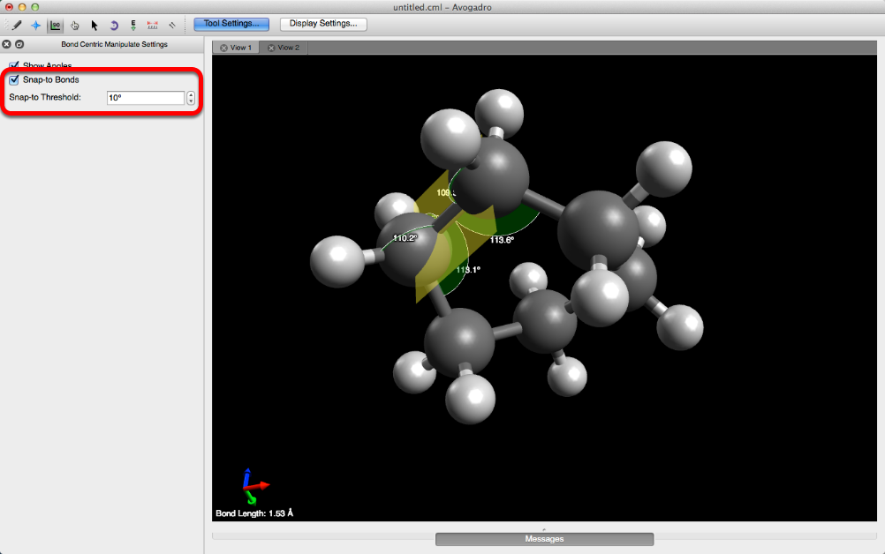
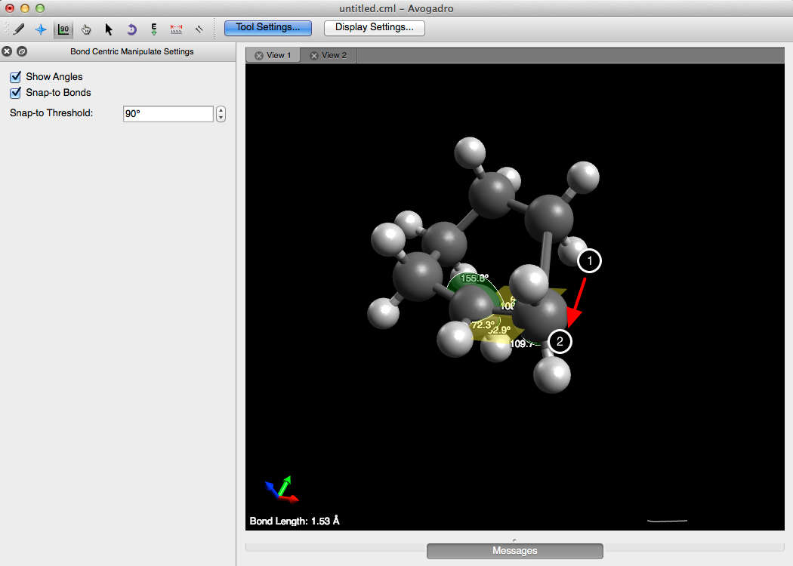
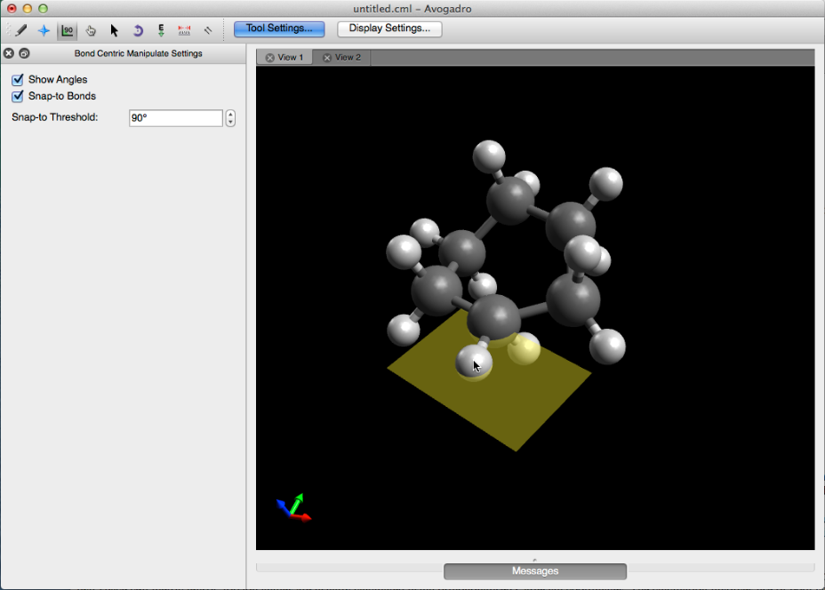

(tools-bond-centric-manipulation-tool)=

# Bond-Centric Manipulation Tool



Keyboard shortcut: <kbd>Ctrl</kbd>+<kbd>7</kbd>

The **Bond-Centric Manipulation Tool** is a powerful tool that allows you to focus on a specific bond and change its length and the surrounding angles, while keeping the rest of the molecule the same.

```{tip}
The Bond-Centric Manipulation Tool provides mouse-based manual adjustment of bond lengths and angles.
If you wish to set these quantities to specific, exact values, it may be more convenient to do this in the relevant [Properties pane](panes-properties).
```

## Starting with the basics:

* To begin using the bond centric manipulate tool, click on a bond within your molecule.
* Clicking on a bond and dragging your cursor allows you to adjust the plane.
* If the "Show Angles" box is checked, the angles from the selected bond to all adjacent bonds are displayed.



* If the "Snap-to Bonds" box is checked you'll notice that the plane changes from yellow to blue as it's rotated. A yellow plane indicates that an adjacent bond _is_ in line with the plane. If the plane depicted is blue, the plane _is not_ in line with any adjacent bonds.
* "Snap-to Threshold" determines how many degrees away a plane has to be to _snap_ to an adjacent bond plane. 
  * For example, the "Snap-to Threshold" shown below is 10 degrees. Therefore if the plane being rotated comes within 10 degrees of an adjacent bond, it will snap to the adjacent bond's plane. 
  * Changing the Snap-to Threshold to 90 degrees is a quick trick for the rotating plane to only snap to adjacent bond planes.



## Adjusting Bonds and Torsion Angles

Once a plane is selected the atoms on either end of the plane can be manipulated, by left-clicking on the atom and dragging. The displayed angles will automatically adjust, and the selected bond will _not_ change in length.



Left-clicking on a substituent, or in this case a hydrogen bonded to one of the selected carbon atoms will allow you to adjust the torsion angle.



