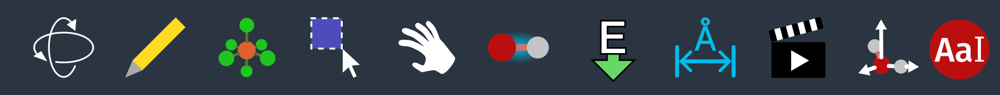

(tools)=

# Tools

Each tool in Avogadro has an associated icon in the toolbar:



Within Avogadro, hovering over a tool icon with the mouse gives a brief description of how to use it.

Tools can be selected either by left-clicking the icon, or using the keyboard by pressing <kbd>Ctrl</kbd> and the corresponding number key (1 through 9 and 0, left to right).

After selecting a tool, the name of the tool and any options available for the tool are displayed in the [Tool Pane](panes-tool-pane).

```{toctree}
---
caption: Tools
maxdepth: 1
---

navigation-tool
draw-tool
template-tool
label-tool
selection-tool
manipulation-tool
bond-centric-manipulation-tool
measure-tool
animation-tool
align-tool
```
