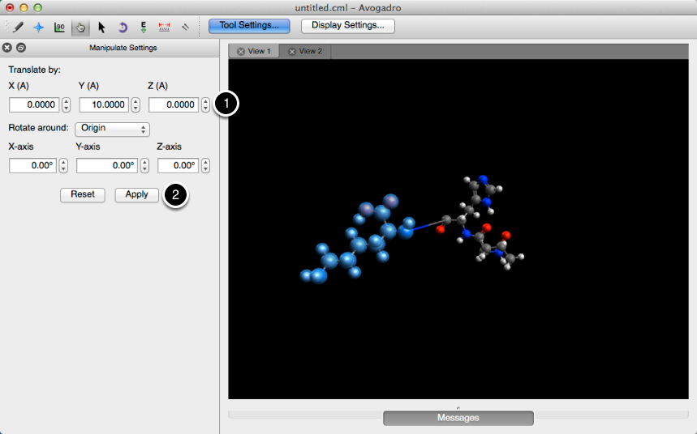
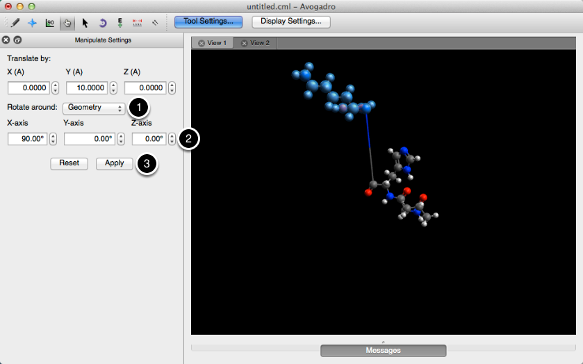
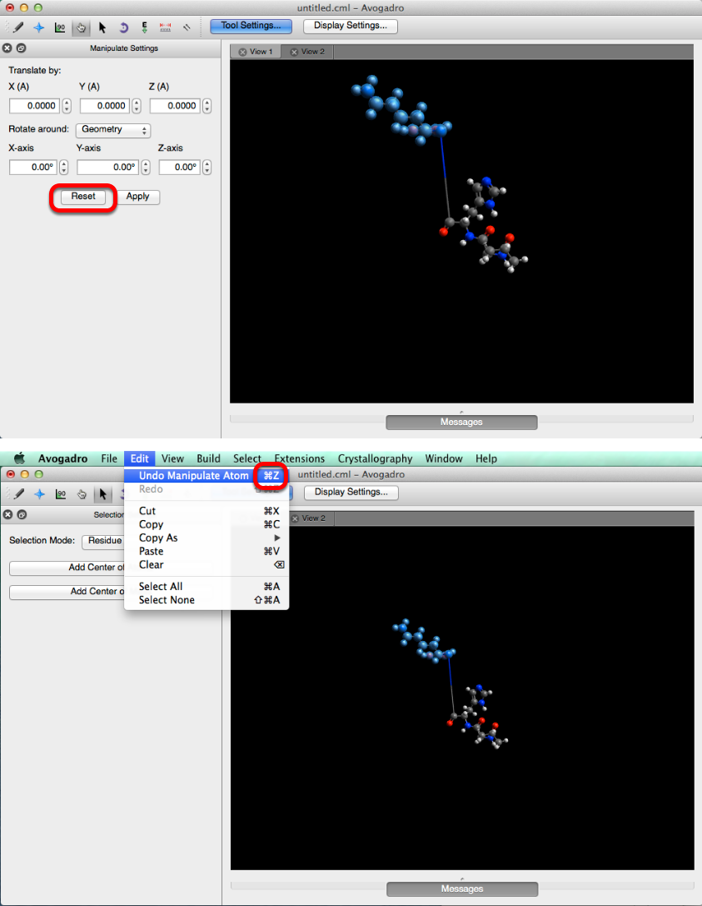

(tools-manipulation-tool)=

# Manipulation Tool


Keyboard shortcut: <kbd>Ctrl</kbd>+<kbd>6</kbd>

The **Manipulation Tool** allows you to **move** atoms, molecules, and fragments.

## Basic usage

**Click and drag** an atom to **manipulate** it.

The Manipulation Tool operates in two different modes:

1. If one or more atoms have been selected, for example with the [Selection Tool](tools-selection-tool), all transformations will be carried out on the entire current selection as one unit.

2. If nothing has been selected, whichever atom is clicked will be moved.

**Translate atoms** or fragments by clicking and dragging them with the **left mouse button**.

```{tip}
When translating with click and drag, atoms will always move parallel to the screen; their depth will not change.
For effective positioning within 3D space, it is thus necessary to combine the Manipulation Tool with the Navigation Tool to rotate the molecule.
```

**Rotate atoms** or fragments by clicking and dragging them with the **right mouse button**.
On a single atom this will have no visible effect.

```{tip}
Rotation with click and drag will always be about the geometric center of the selection.
```

The Manipulation Tool is automatically selected after [inserting a fragment](menus-build-menu-insert) via **Build ⇒ Insert**, to enable quick and easy positioning of the new fragment.

## Pane options

The options in the Manipulate Pane allow you to apply transformations mathematically to the currently selected atoms.

Translate by:
: Specify the distances, in angstrom, to shift the selection along the X-, Y-, and Z-axes.

{height=300px align=center}

Rotate around:
: Specify the angles, in degrees, to rotate the selection around the X-, Y-, and Z-axes, as well as the centre of the rotation.

  The rotation can be carried out around the center of the current geometry or the origin, selected from the drop-down menu.
  The X-, Y-, and Z-axes used for the rotation will be considered to intersect at this point.

{height=300px align=center}

Apply
: Apply the specified transformations to the current selection.

  If values for both translation and rotation have been entered, both will be applied.

Reset
: Reset all values in the translation and rotation boxes to 0.

  This does not reset the molecule or reverse any transformations; if you want to undo your adjustments, go to the `Edit` menu in the top bar and select `Undo Manipulate Atom`.

{height=600px align=center}

:::{note}
The icon for the Manipulation Tool is adapted from a design by [Ryan Dell](https://thenounproject.com/ryandeel/), a contributor to the Noun Project.
:::
