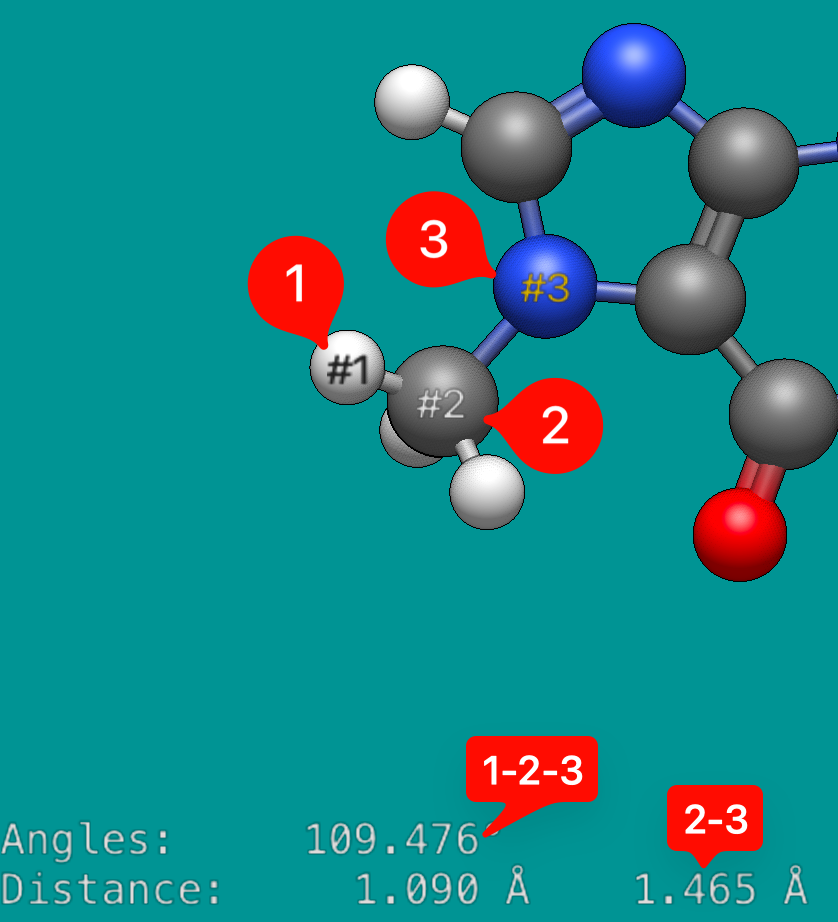
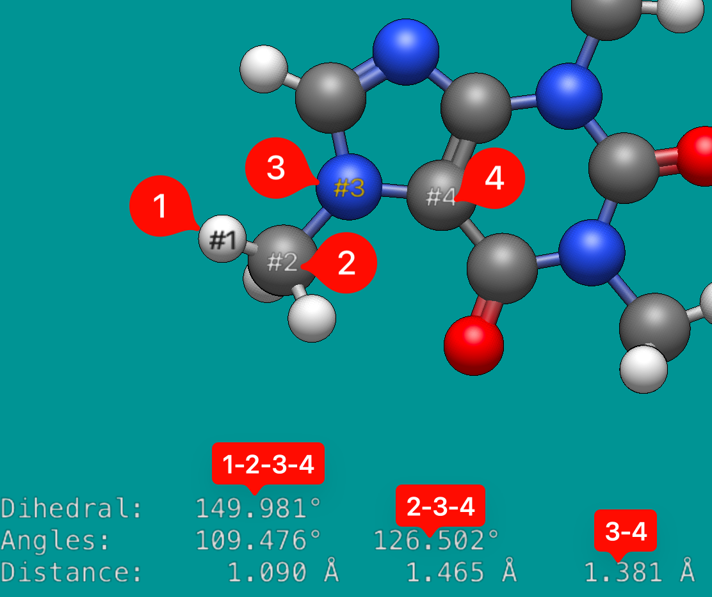

# Measure Tool

Keyboard shortcut: <kbd>Ctrl</kbd>+<kbd>8</kbd>

The measure tool determines bond lengths, angles, and dihedrals. It allows you to select and assess up to four atoms.

As you click on atoms Avogadro will automatically calculate the distances between atoms in a respective order.

For example, the distance between atom 1 and 2 is 1.090 Å \(displayed below\).

Avogadro will also determine the angle between atoms, if at least three atoms have been selected, as well as indicating the distance between atoms 2 and 3.

The second atom is used as the vertex (e.g., atoms 1-2-3 = 109.476°)

If four atoms are selected, a dihedral angle is determined (e.g. 149.981° for atoms 1-2-3-4), as well as the 2-3-4 angle, and the 3-4 distance.

Clicking on an atom will remove it from the list, or double clicking the display will reset the atoms previously selected.

