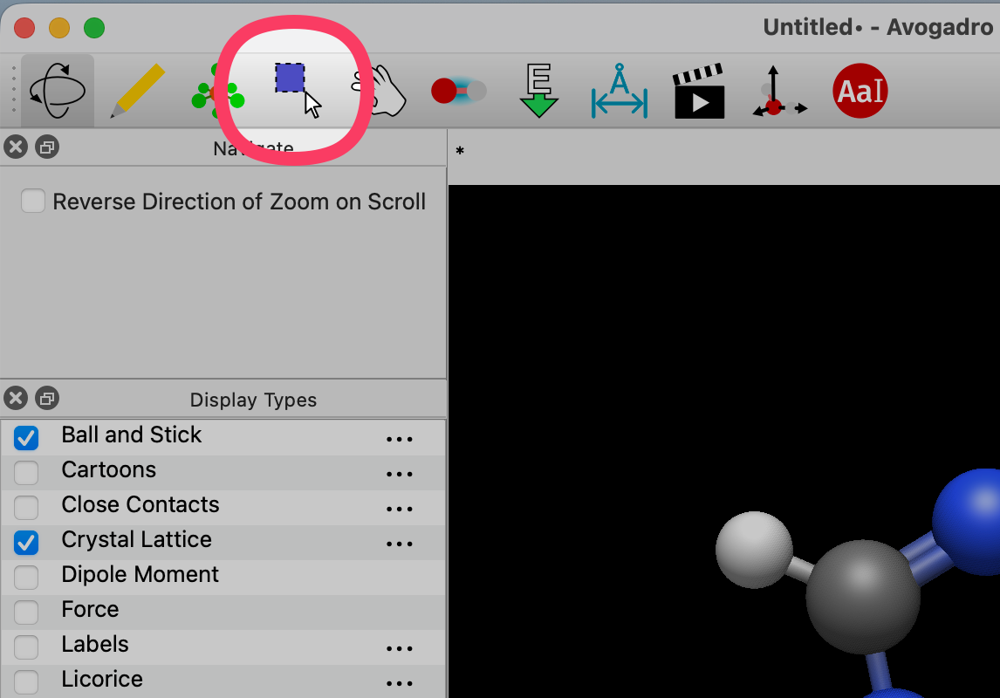
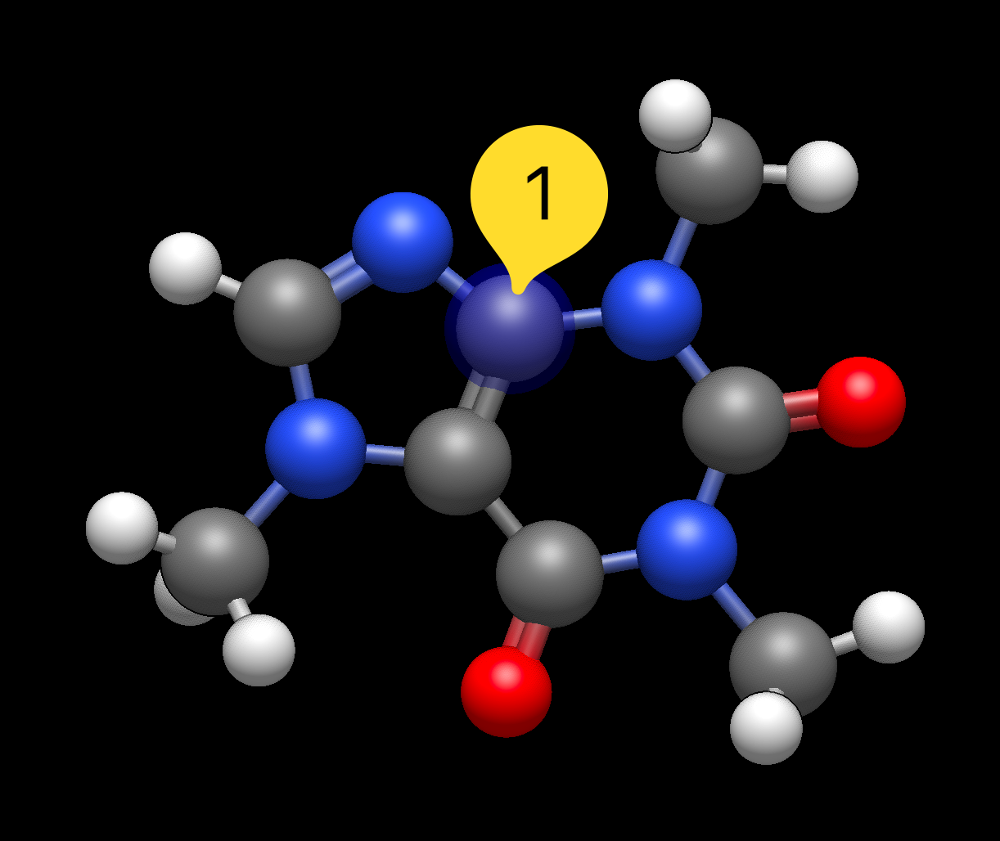
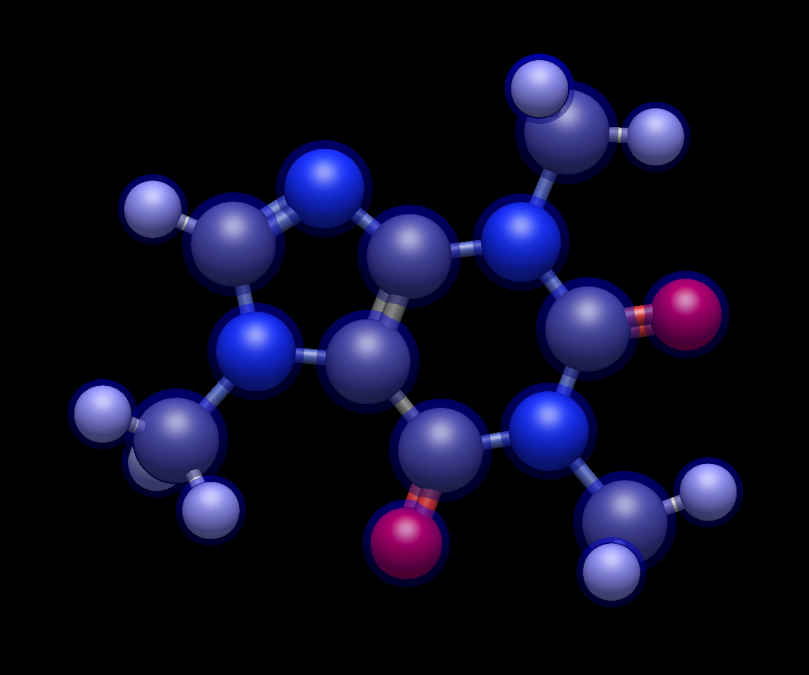
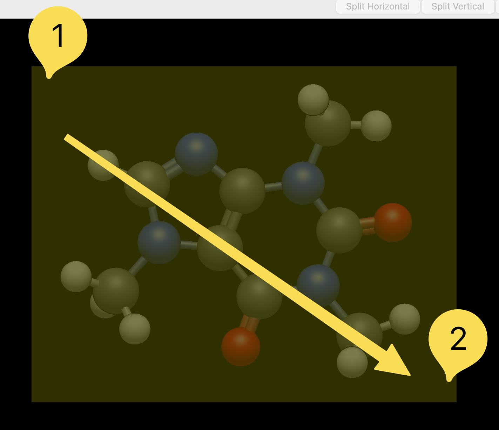

# Selection Tool

The selection tool allows the indiviual selection of atoms, bonds, or fragments.

The select provides you with the ability to select a single atom within a molecule. This is achieved by left clicking the atom. Press and holding the "shift" key allows for the selection of multiple atoms.

Right clicking on the black display will clear the selection made.

You can also double-click on an atom to select all atoms connected in that fragment or molecule.

Clicking and dragging your cursor is another way molecules, or fragments of molecules can be selected.

More information on selections can be found in the ["Select" menu](select-menu).
