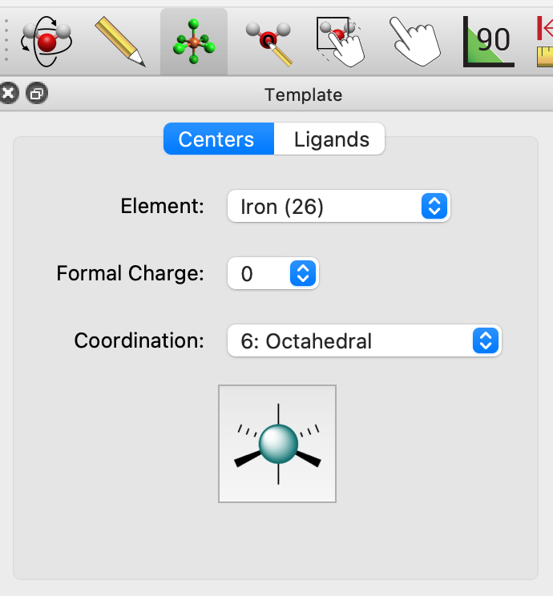
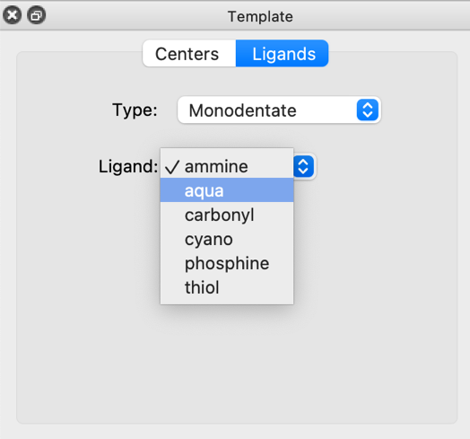

(template-tool)=

# Template Tool

The template tool makes it easy to build up molecules from pre-defined ligands or functional groups, for example metal complexes or organometallic species.

## Inserting Atoms with Specific Geometry

The "Element" menu includes many common transition metals as well as carbon, phosphorous and sulfur, as well as "Other…" which brings up a periodic table to select any element.

The "Formal Charge" menu allows you to specify a formal charge on the atom, which is used to calculate the total molecular charge for a calculation or force field optimization.

The "Coordination" menu allows you to specify the number of attachment points and geometry of the atom, including common arrangements from one to eight ligands. This includes linear, trigonal planar, tetrahedral, square planar, trigonal bipyramidal, octahedral, as well as less common geometries such as square pyramidal, trigonal prism, pentagonal bipyramidal, and square antiprism.

After selecting a coordination type from the menu, the preview will update to reflect the geometry.

Once you have selected the element, formal charge (if desired), and coordination, click in the scene to insert the atom.

## Attaching Ligands

The second tab in the template tool window allows you to select from a range of ligand types, including common [bidentate](https://en.wikipedia.org/wiki/Denticity), [tridentate](https://en.wikipedia.org/wiki/Tridentate_ligand), [tetradentate](https://en.wikipedia.org/wiki/Tetradentate_ligand), and [hexadentate](https://en.wikipedia.org/wiki/Hexadentate_ligand) ligands as well as conjugated [haptic ligands](https://en.wikipedia.org/wiki/Hapticity).

After you change the type of ligand, the list of ligands will change accordingly. Similarly, after chosing a particular ligand, the preview image will update.

For monodentate or haptic ligands, click on a hydrogen atom to attach the new ligand.

For bidentate, tridentate, tetradentate, and hexadentate ligands, click on multiple hydrogen atoms and the ligand will be attached accordingly. For example for a tridentate ligand, click on three atoms in order. If you click on three sites in a line, but the tridentate ligand is a triangle, Avogadro will attach a "best fit."

## Attaching Functional Groups

Functional groups are similar to monodentate ligands in that they attach to a molecule through one new bond.

Beyond the common choices, "Other…" includes a library of over 100 functional groups organized by element, e.g., sulfonates, acid anhydrides, boronic acids, etc.

After selecting a group, a preview will appear. Click the "Insert" button and click on a hydrogen atom in the scene to attach the fragment of your choice.

## Creating New Ligands

While the ligand library includes many common ligands, you may wish to create your own or tweak a ligand before attachment.

As an example, we will build the salen ligand and add the attachment point for this tetradentate ligand. The process is similar for other ligands -- Avogadro will use the location of a dummy atom (element zero) to determine where to attach to a metal or molecule.

After creating your ligand molecule, you should select the atoms which will be the attachement sites:

The Build ⇒ Add Centroid command will add a dummy atom at the center of the selected atoms:

The ligand will now have a centroid dummy atom added. Draw bonds as desired to the attachment sites.

The ligand can either be copied to the clipboard to insert via the Clipboard ligand type, or saved as CJSON to contribute to the [fragment repository](https://github.com/openchemistry/fragments)

## Creating New Haptic Ligands

Haptic ligands indicate bonding between a metal center and a delocalized pi system, such as an aromatic ligand.

As an example, we will build up an η4-cyclooctatetraene ligand. Either draw the molecule or use File ⇒ Import ⇒ Download by Name… to insert the basic molecule.

Now select the four atoms to use for the haptic ligand:

Now use the "Add Centroid" command to add a dummy atom at the centroid of the selected atoms. This is useful to create distinct hapticity (e.g., η3 cyclopentadienyl after selecting three carbon atoms instead of five):

For a haptic ligand, we need one more dummy atom, perpendicular to the pi system. We can add an additional dummy atom **perpendicular** to the centroid:

After adding the perpendicular attachment, draw a bond between the centroid and the attachment site.

You can either save this file as CJSON to contribute to the repository, or "Select None" to deselect all atoms and copy the ligand to insert into a new molecule.
