(tools-template-tool)=

# Template Tool

Keyboard shortcut: <kbd>Ctrl</kbd>+<kbd>3</kbd>

With the **Template Tool**, a variety of **pre-built fragments** can be created.

The Template Tool makes it easy to build up metal complexes or organometallic species from pre-defined coordination centers and ligands.

The Template Tool also enables rapid addition of functional groups to an organic framework.

:::{versionadded} 2.0
:::

(template-tool-basic-usage)=
## Basic Usage

Ligands and functional groups must be added to an existing atom (a "center"), whether this be an atom within an organic framework or a metal center.

Elements in the third period and below can often exhibit multiple different coordination geometries, which are not easily created using the [Draw Tool](tools-draw-tool).
To achieve these, use the **"Centers"** templates.

A center of any element and with any common coordination geometry can be selected from the **Center** tab of the **Template** pane.
**Left-click** on an **empty space** in the view pane to **create a center** with attached hydrogens at each coordination site.

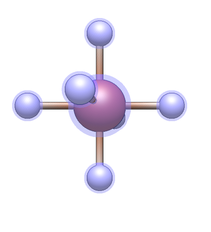{height=300px align=center}

Once at least one center is present, ligands or functional groups can be added.
The desired ligand or group can be selected from the respective tabs of the **Template** pane.
**Left-click any hydrogen atom** in the view pane to replace it with the ligand or functional group, with the attachment point as shown in the preview image.

:::{tip}
Ligands and functional groups can be added not only to centers created with the Template Tool but to any atom that bears hydrogen atoms.

For example, the Template Tool could be used to rapidly add acyl groups to sugar rings.
:::

:::{tip}
The Template Tool is designed for quickly appending ligands and functional groups to an existing molecule.
Discrete small organic molecules can not be created with the Template Tool by clicking on an empty space.

To create organic molecules with a single click, use [**Build ⇒ Insert ⇒ Molecule…**](menus-build-menu-insert) instead.
:::

(template-tool-options)=
## Options

Switching tabs chooses between the creation of centers, ligands, and functional groups, and presents different options in the pane.

(template-tool-centers-tab)=
### Centers Tab

Element
: Select the element of new centers.

  The currently selected element can be changed by selecting from the **Element** drop-down menu.
  Various common elements are shown for easy access, but any element can be selected from the periodic table by choosing **Other…**.

  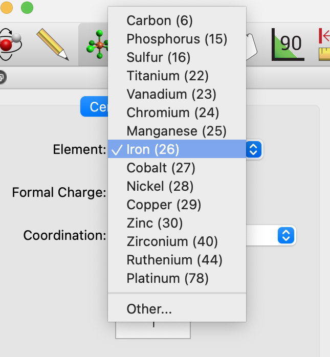{height=300px align=center}

Formal Charge
: Set the formal charge assigned to new centers.

  Ions can be created by setting their charge via the drop-down.
  Atoms' formal charges are not shown visually but are used to calculate the total molecular charge for a calculation or force field optimization.
  Formal charges can be viewed and edited in [Atom Properties](panes-properties-atom).

Coordination
: Select the coordination geometry of new centers.

  The **Coordination** drop-down allows the specification of the valency and geometry of the atom, including common arrangements of one to eight ligands.
  This includes linear, trigonal planar, tetrahedral, square planar, trigonal bipyramidal, octahedral, as well as less common geometries such as square pyramidal, trigonal prism, pentagonal bipyramidal, and square antiprism.

  A preview of the selected coordination geometry is shown below the drop-down.

  {height=300px align=center}

(template-tool-ligands-tab)=
### Ligands Tab

Type
: Specify the denticity or hapticity of the ligand.

  The drop-down allows selection from a range of ligand denticities, including common [bidentate](https://en.wikipedia.org/wiki/Denticity), [tridentate](https://en.wikipedia.org/wiki/Tridentate_ligand), [tetradentate](https://en.wikipedia.org/wiki/Tetradentate_ligand), and [hexadentate](https://en.wikipedia.org/wiki/Hexadentate_ligand) ligands, as well as conjugated [haptic ligands](https://en.wikipedia.org/wiki/Hapticity).

  By choosing **From Clipboard**, a ligand that has been copied to the clipboard can be used.
  For further details on creating ligands, see below.

Ligand
: Choose a specific ligand to be created.

  The drop-down is used to choose a specific ligand.
  Its contents will update based on the choice of **Type**.
  Various common ligands are shown for easy access, but more can be selected from the library by choosing **Other…**.

  A preview of the selected ligand and its attachment point is shown below the drop-down.

  For monodentate or haptic ligands, left-click on a hydrogen atom to attach the new ligand.

  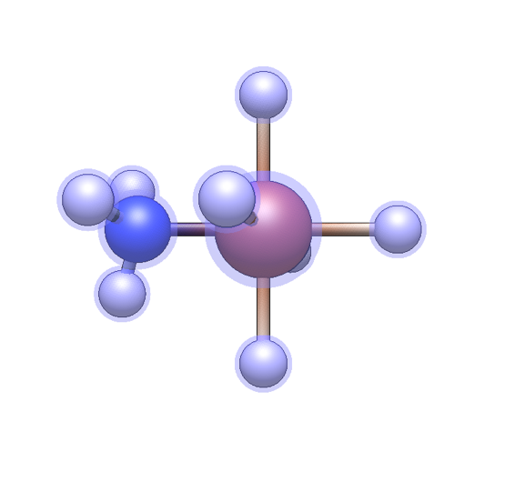{height=300px align=center}

  For bidentate, tridentate, tetradentate, and hexadentate ligands, one hydrogen atom must be left-clicked for each attachment point.
  For example, for a tridentate ligand, click on three atoms in order.
  If the shape of the sites chosen does not match the ligand template (e.g. three sites in a line are chosen, but the tridentate ligand is a triangle), Avogadro will attempt a "best fit".

  {height=300px align=center}

(template-tool-groups-tab)=
### Groups Tab

Functional groups are similar to monodentate ligands in that they attach to a molecule through one new bond, and there is some overlap in the available fragments.

However, the focus is on covalently bonded organic moieties.

Group
: Choose a functional group to be created.

  The currently selected functional group can be changed by selecting from the drop-down menu.
  Various common groups are shown for easy access, but more can be selected from the library by choosing **Other…**.
  The library contains over 100 functional groups organized by element including sulfonates, acid anhydrides, boronic acids, and many more.

  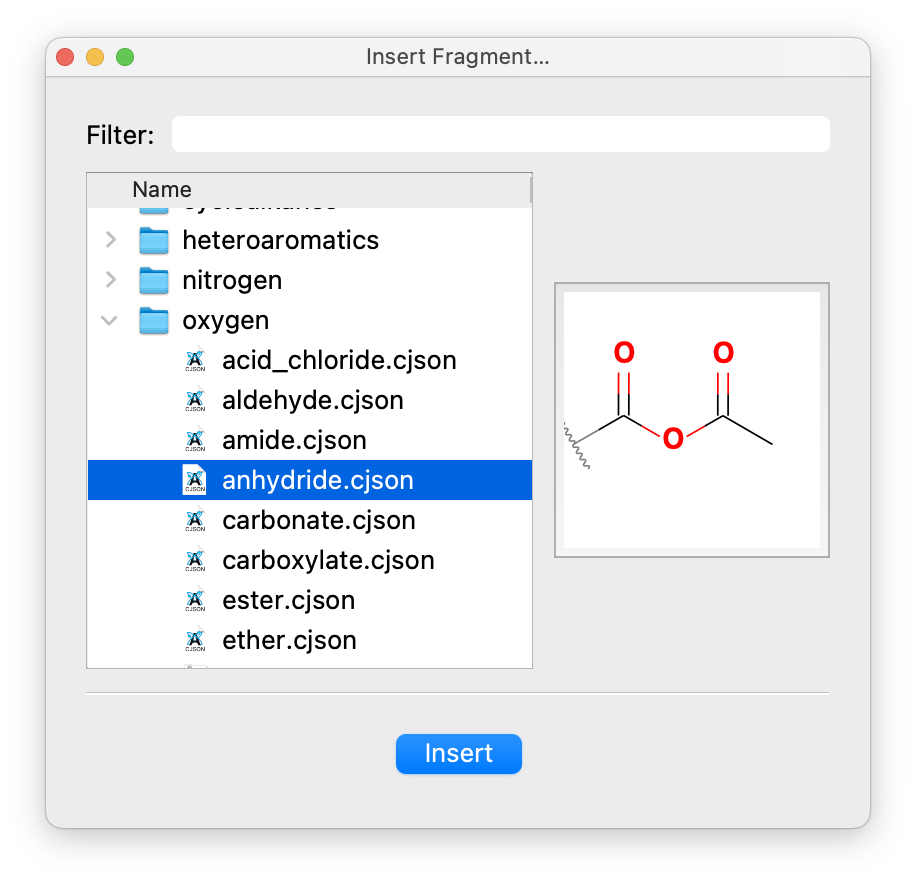{height=300px align=center}

  A preview of the selected functional group and its attachment point is shown below the drop-down.

(template-tool-shortcuts)=
## Keyboard Shortcuts

The Template Tool supports extensive keyboard shortcuts for rapid selection of elements, coordination geometries, ligands, and functional groups. We welcome ideas for other shortcuts on [our forum](https://discuss.avogadro.cc)

(template-shortcuts-navigation)=
### General Navigation

| Key | Action |
|-----|--------|
| <kbd>←</kbd> or <kbd>[</kbd> | Switch to previous tab |
| <kbd>→</kbd> or <kbd>]</kbd> | Switch to next tab |

(template-shortcuts-centers)=
### Centers Tab

**Element Selection:** Type any element symbol (e.g., `Fe`, `Cu`, `Ni`) to select that element.

**Formal Charge:**

| Key | Action |
|-----|--------|
| <kbd>+</kbd> | Increase formal charge |
| <kbd>-</kbd> | Decrease formal charge |

**Coordination Geometry:**

| Key | Coordination | Geometry |
|-----|--------------|----------|
| <kbd>1</kbd> | 1 | Linear (terminal) |
| <kbd>2</kbd> | 2 | Linear |
| <kbd>3</kbd> | 3 | Trigonal planar |
| <kbd>4</kbd> | 4 | Tetrahedral |
| <kbd>4</kbd><kbd>4</kbd> | 4 | Square planar |
| <kbd>5</kbd> | 5 | Trigonal bipyramidal |
| <kbd>5</kbd><kbd>5</kbd> | 5 | Square pyramidal |
| <kbd>6</kbd> | 6 | Octahedral |
| <kbd>6</kbd><kbd>6</kbd> | 6 | Trigonal prismatic |
| <kbd>7</kbd> | 7 | Pentagonal bipyramidal |
| <kbd>8</kbd> | 8 | Square antiprismatic |

(template-shortcuts-ligands)=
### Ligands Tab

**Monodentate Ligands:**

| Key | Ligand |
|-----|--------|
| <kbd>a</kbd> or <kbd>o</kbd> | Aqua (H₂O) |
| <kbd>co</kbd> | Carbonyl (CO) |
| <kbd>cn</kbd> | Cyano (CN⁻) |
| <kbd>n</kbd> | Ammine (NH₃) |
| <kbd>p</kbd> | Phosphine (PH₃) |
| <kbd>pyr</kbd> | Pyridyl |
| <kbd>s</kbd> | Thiol (SH⁻) |

**Bidentate Ligands:**

| Key | Ligand |
|-----|--------|
| <kbd>acac</kbd> | Acetylacetonate |
| <kbd>bpy</kbd> | Bipyridine |
| <kbd>dmg</kbd> | Dimethylglyoxime |
| <kbd>dmpe</kbd> | 1,2-bis(dimethylphosphino)ethane |
| <kbd>dppe</kbd> | 1,2-bis(diphenylphosphino)ethane |
| <kbd>en</kbd> | Ethylenediamine |
| <kbd>ox</kbd> | Oxalate |
| <kbd>phen</kbd> | Phenanthroline |

**Tridentate and Higher:**

| Key | Ligand |
|-----|--------|
| <kbd>tpy</kbd> | Terpyridine (tridentate) |
| <kbd>pc</kbd> | Phthalocyanine (tetradentate) |
| <kbd>por</kbd> | Porphin (tetradentate) |
| <kbd>sal</kbd> | Salen (tetradentate) |
| <kbd>edta</kbd> | EDTA (hexadentate) |

**Haptic Ligands:**

| Key | Ligand |
|-----|--------|
| <kbd>e</kbd><kbd>2</kbd> | η²-Ethylene |
| <kbd>e</kbd><kbd>3</kbd> | η³-Allyl |
| <kbd>e</kbd><kbd>4</kbd> | η⁴-Cyclooctadiene |
| <kbd>e</kbd><kbd>5</kbd> or <kbd>c</kbd><kbd>p</kbd>| η⁵-Cyclopentadienyl |
| <kbd>e</kbd><kbd>6</kbd> | η⁶-Benzene |

(template-shortcuts-groups)=
### Groups Tab

**Alkyl Chains:**

| Key | Group |
|-----|-------|
| <kbd>c</kbd> or <kbd>c1</kbd> | Methyl |
| <kbd>c2</kbd> | Ethyl |
| <kbd>c3</kbd> | Propyl |
| <kbd>c4</kbd> | Butyl |
| <kbd>c5</kbd> – <kbd>c9</kbd> | Pentyl – Nonyl |
| <kbd>c0</kbd> | Decyl |

**Cycloalkyl** (uppercase C):

| Key | Group |
|-----|-------|
| <kbd>C3</kbd> | Cyclopropane |
| <kbd>C4</kbd> | Cyclobutane |
| <kbd>C5</kbd> | Cyclopentane |
| <kbd>C6</kbd> | Cyclohexane |
| <kbd>C7</kbd> - <kbd>C9</kbd> | Cycloheptane – Cyclononane |
| <kbd>C</kbd><kbd>0</kbd> | Cyclodecane |

**Branched Alkyl:**

| Key | Group |
|-----|-------|
| <kbd>I</kbd> | Iso-propyl |
| <kbd>K</kbd> or <kbd>c</kbd><kbd>m</kbd> | tert-Butyl |

**Common Functional Groups:**

| Key | Group |
|-----|-------|
| <kbd>a</kbd> | Phenyl |
| <kbd>C</kbd> or <kbd>co2</kbd> | Carboxylate |
| <kbd>cn</kbd> | Nitrile |
| <kbd>co</kbd> | Aldehyde |
| <kbd>E</kbd> | Ester |
| <kbd>F</kbd> | Trifluoromethyl |
| <kbd>N</kbd> or <kbd>no2</kbd> | Nitro |
| <kbd>om</kbd> | Methoxy |
| <kbd>P</kbd> or <kbd>po3</kbd> | Phosphate |
| <kbd>S</kbd> or <kbd>so3</kbd> | Sulfonate |

**Protecting Groups:**

| Key | Group |
|-----|-------|
| <kbd>boc</kbd> | BOC (tert-butyloxycarbonyl) |
| <kbd>cbz</kbd> | CBZ (benzyloxycarbonyl) |
| <kbd>fmoc</kbd> | FMOC (fluorenylmethoxycarbonyl) |
| <kbd>ms</kbd> | Mesyl |
| <kbd>tos</kbd> or <kbd>ts</kbd> | Tosyl |
| <kbd>tr</kbd> | Trityl |
| <kbd>troc</kbd> | TROC (2,2,2-trichloroethoxycarbonyl) |

:::{tip}
Shortcuts are case-sensitive. For example, <kbd>c</kbd><kbd>6</kbd> selects hexyl while <kbd>C</kbd><kbd>6</kbd> selects cyclohexane.
:::

:::{note}
Multi-character shortcuts have a 2-second timeout. The buffer clears automatically after 5 characters if no match is found.
:::

(template-tool-creating-ligands)=
## Creating New Ligands

While the ligand library includes many common ligands, you may wish to create your own or tweak a ligand before attachment.

An existing structure open in Avogadro can be easily turned into a ligand.
It could have been, for example, drawn by hand, or loaded from a calculation output file.

To demonstrate, we will build the salen ligand and add the attachment point for this tetradentate ligand using a dummy atom (an atom of element 0).
The process is similar for other ligands -- Avogadro will use the location of a dummy atom to determine where to attach to a metal or molecule.

After creating your ligand molecule, select the atoms which will be the attachment sites:

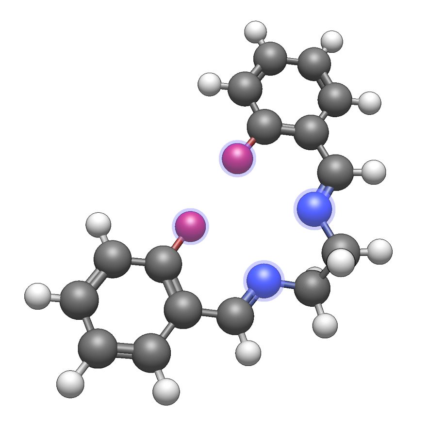{height=300px align=center}

The **Build ⇒ Add Centroid** command will add a dummy atom at the center of the selected atoms:

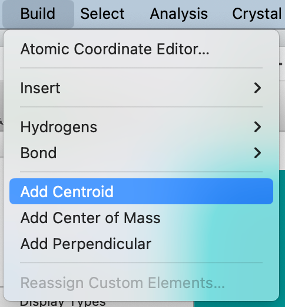{height=300px align=center}

The ligand will now have a centroid dummy atom added.
The dummy atom can be manipulated in the same way as any other atom.
Draw bonds as desired between the dummy atom and the attachment sites.

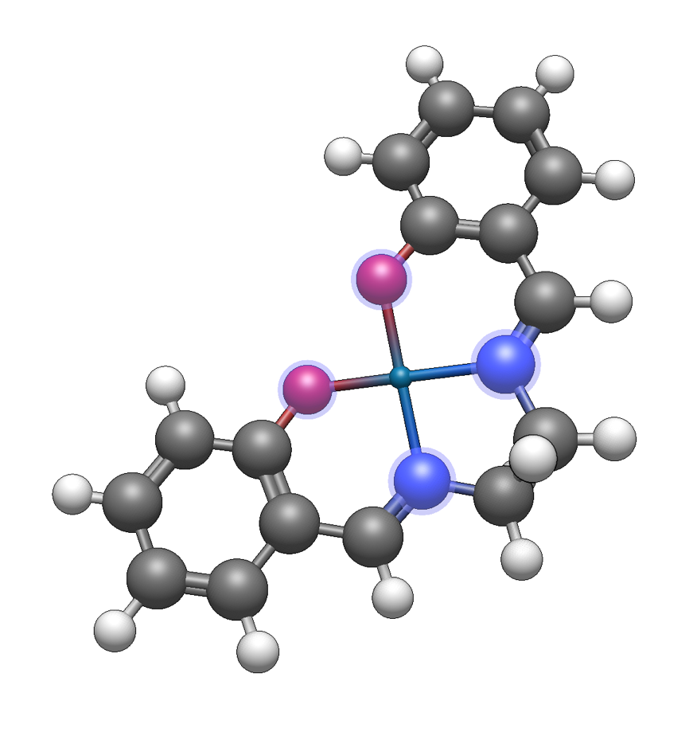{height=300px align=center}

The ligand can either be copied to the clipboard to allow insertion via the **From Clipboard** ligand type, or saved as CJSON to contribute to the [fragment repository](https://github.com/openchemistry/fragments).

(template-tool-creating-haptic-ligands)=
## Creating New Haptic Ligands

Haptic ligands indicate bonding between a metal center and a delocalized pi system, such as an aromatic ligand.

As an example, we will build up an η{sup}`4`-cyclooctatetraene ligand.
Either draw the molecule or use **File ⇒ Import ⇒ Download by Name…** to insert the basic molecule.

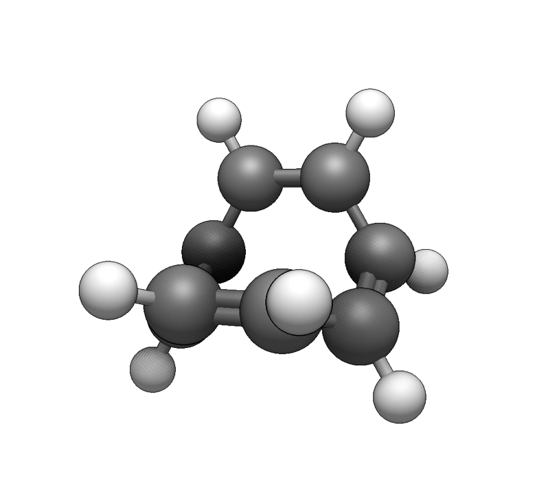{height=300px align=center}

Now select the four atoms to use for the haptic ligand:

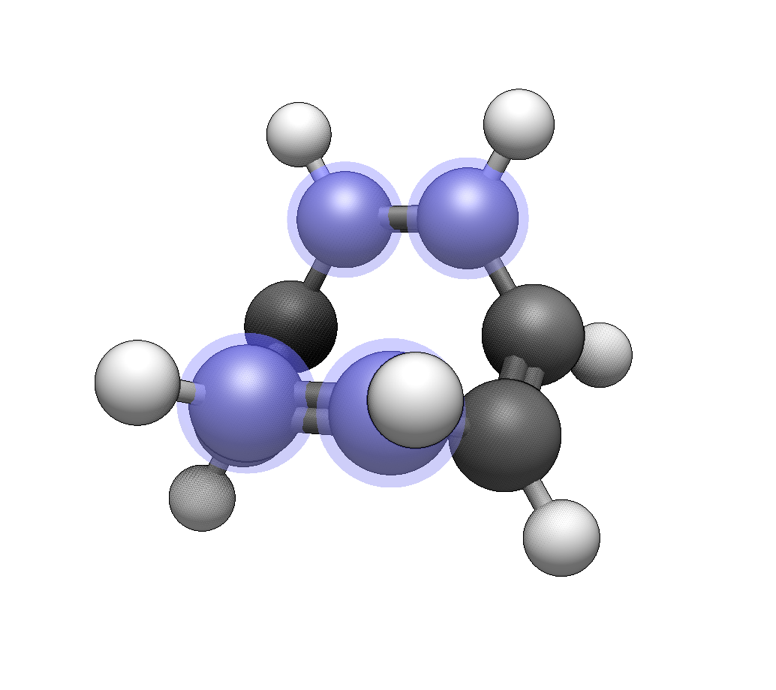{height=300px align=center}

Now use the **Build ⇒ Add Centroid** command to add a dummy atom at the centroid of the selected atoms.
This is useful to create distinct hapticity (e.g. η{sup}`3`-cyclopentadienyl after selecting three carbon atoms instead of five):

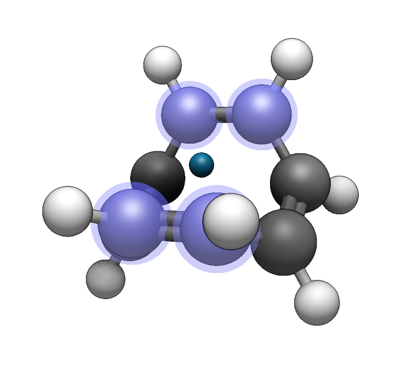{height=300px align=center}

For a haptic ligand, we need one more dummy atom, perpendicular to the pi system.
We can add an additional dummy atom **perpendicular** to the centroid using the **Build ⇒ Add Perpendicular** command:

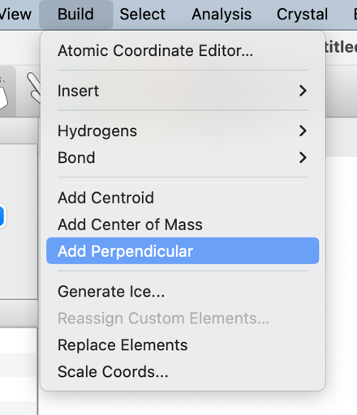{height=300px align=center}

After adding the perpendicular attachment, draw a bond between the centroid and the attachment site.

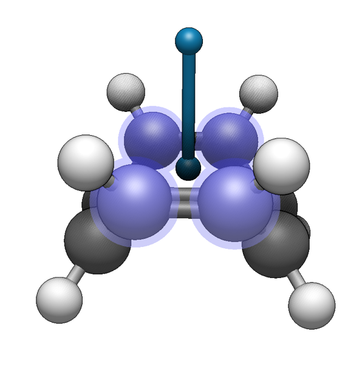{height=300px align=center}

As before, you can either save this file as CJSON to contribute to the repository, or copy the ligand to the clipboard to insert into a new molecule.

## See Also

- [Building Molecules with Templates Video](https://youtu.be/RC4NZp6nnD8)
- {ref}`tutorials-building-metal-complexes` – Build coordination compounds and organometallic complexes step by step
- {ref}`tutorials-building-organic-molecules` – Rapidly construct organic molecules using functional groups
