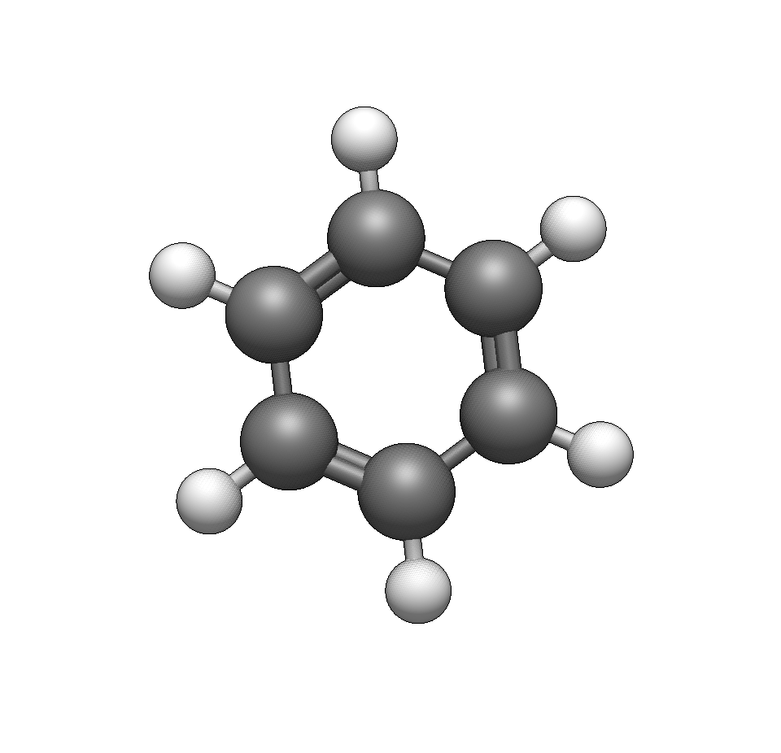
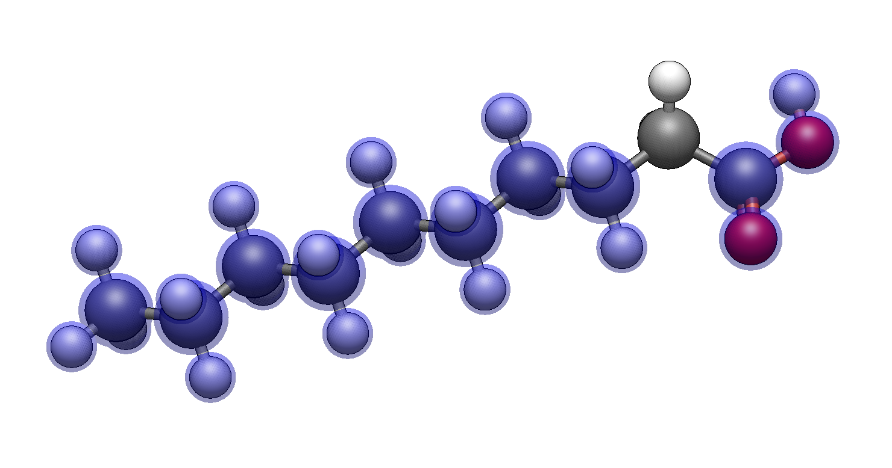
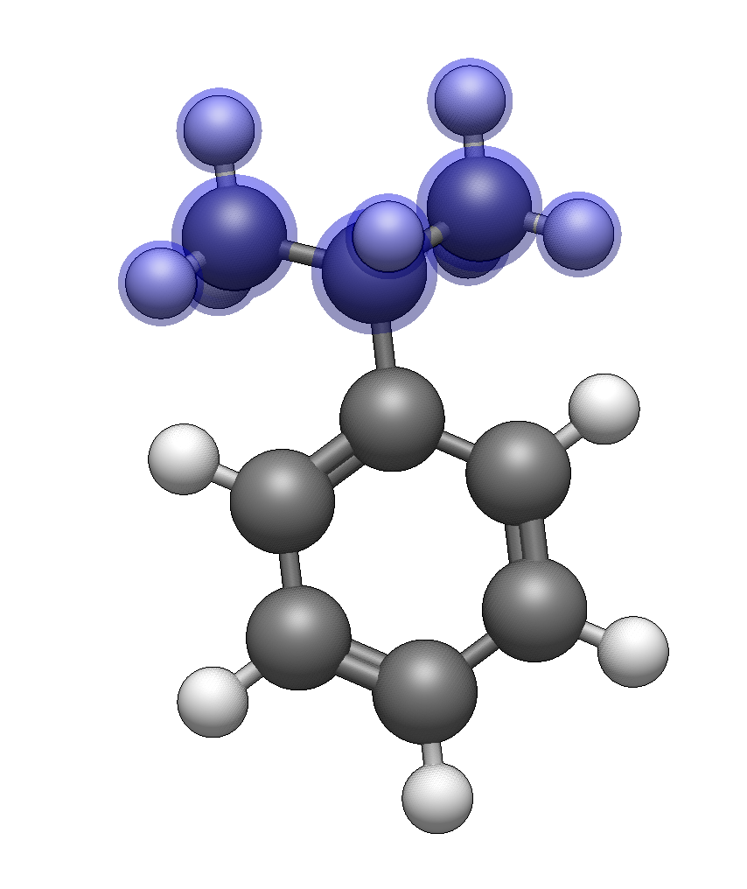
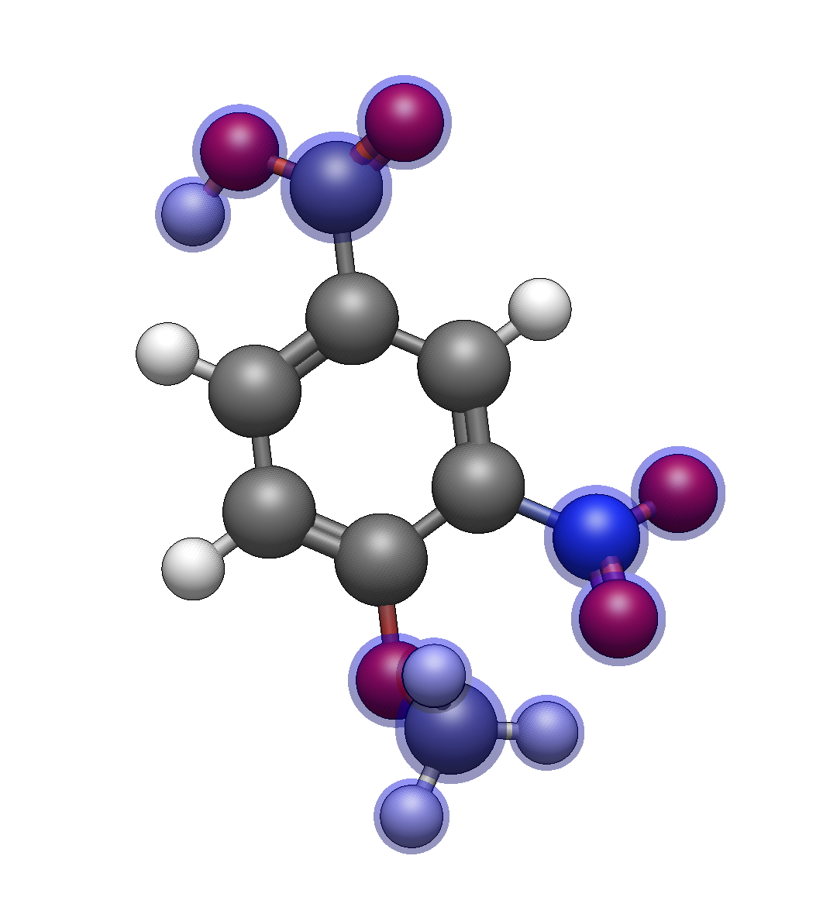
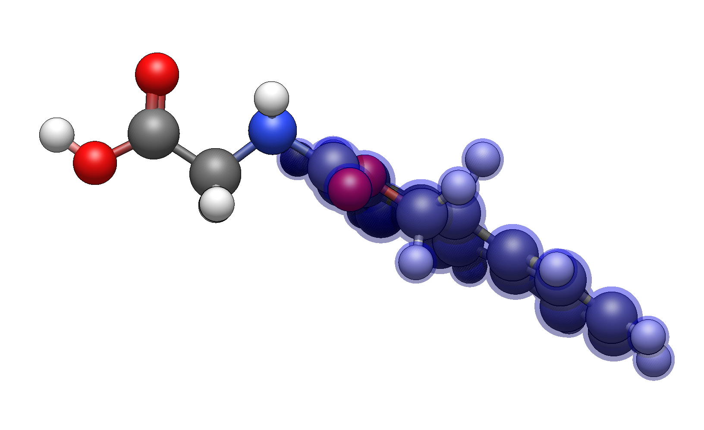

(tutorials-building-organic-molecules)=

# Building Organic Molecules with Functional Groups

This tutorial demonstrates how to rapidly build organic molecules using the [Template Tool](tools-template-tool)'s functional group library and keyboard shortcuts. Rather than drawing every atom, you can attach complete functional groups to a molecular scaffold with a few keystrokes.

Activate the [Template Tool](tools-template-tool) with <kbd>Ctrl</kbd>+<kbd>3</kbd> or by clicking its icon in the toolbar, then select the **Groups** tab.

## Part 1: Building a Substituted Aromatic

Let's build [4-nitrotoluene](https://en.wikipedia.org/wiki/4-Nitrotoluene) by starting with [benzene](https://en.wikipedia.org/wiki/Benzene) and adding functional groups.

**Start with benzene**

Use **Build → Insert → Molecule...** and search for "benzene", or draw a benzene ring with the [Draw Tool](tools-draw-tool).

{height=300px align=center}

**Switch to the [Template Tool](tools-template-tool)**

Press <kbd>Ctrl</kbd>+<kbd>3</kbd> and navigate to the **Groups** tab (press <kbd>→</kbd> twice or click the tab).

**Add a methyl group**

Type `c` to select methyl. Click on any hydrogen on the benzene ring to replace it with -CH₃.

{height=300px align=center}

**Add a nitro group**

Type `N` (uppercase) to select nitro. Click on the hydrogen **para** to the methyl group (directly opposite) to create 4-nitrotoluene.

{height=300px align=center}

**Optimize**

Press <kbd>Ctrl</kbd>+<kbd>Alt</kbd>+<kbd>O</kbd> to clean up the geometry. You can also switch to the [Auto Optimize](tools-autoopt-tool) tool.

:::{tip}
Common aromatic substitution shortcuts:
- `c` — Methyl
- `N` — Nitro
- `om` — Methoxy
- `F` — Trifluoromethyl
- `a` — Phenyl (for [biphenyl](https://en.wikipedia.org/wiki/Biphenyl) systems)
:::

You can find other {ref}`keyboard shortcuts for functional groups<template-shortcuts-groups>`.

## Part 2: Building Alkyl Chains Quickly

The [Template Tool](tools-template-tool) provides shortcuts for building alkyl chains without drawing each carbon. Let's build a simple fatty acid: [decanoic acid](https://en.wikipedia.org/wiki/Decanoic_acid).

**Start with a carboxylic acid**

Draw a single carbon with the [Draw Tool](tools-draw-tool), or start with [methane](https://en.wikipedia.org/wiki/Methane) from **Build → Insert → Molecule...**

{height=300px align=center}

**Add the carboxylic acid**

In the [Template Tool](tools-template-tool) **{ref}`Groups tab<template-tool-groups-tab>`**, type `C` (uppercase) or `co2` to select carboxylate. Click on a hydrogen to add the -COOH group. We now have [acetic acid](https://en.wikipedia.org/wiki/Acetic_acid).

{height=300px align=center}

**Build the alkyl chain**

Now we'll extend the chain. The shortcuts for n-alkyl groups are:

| Shortcut | Chain Length |
|----------|--------------|
| `c` or `c1` | Methyl (1 carbon) |
| `c2` | Ethyl (2 carbons) |
| `c3` | Propyl (3 carbons) |
| `c4` | Butyl (4 carbons) |
| `c5` | Pentyl (5 carbons) |
| `c6` | Hexyl (6 carbons) |
| `c7` | Heptyl (7 carbons) |
| `c8` | Octyl (8 carbons) |
| `c9` | Nonyl (9 carbons) |
| `c0` | Decyl (10 carbons) |

For decanoic acid (10 carbons total including the carboxyl), type `c8` to select octyl. Click on the hydrogen at the end of the carboxylic acid's carbon to add an 8-carbon chain, giving you a 10-carbon fatty acid.

:::{tip}
If you can't see the entire molecule, you can go to View ⇒ Center to re-center the view.
:::

{height=300px align=center}

**Optimize**

Run geometry optimization or use the [Auto Optimize](tools-autoopt-tool) tool to get a reasonable chain conformation.

:::{note}
Shortcuts are case-sensitive! Lowercase `c` followed by a number gives you n-alkyl chains, while uppercase `C` followed by a number gives you **cycloalkyl** groups.
:::

## Part 3: Branched and Cyclic Groups

Organic molecules often have branched or cyclic substituents. Here's how to add them efficiently.

### Branched Alkyl Groups

Build [isopropylbenzene](https://en.wikipedia.org/wiki/cumene) also known as "cumene" (a simple branched aromatic):

1. Start with benzene
2. Type `I` (uppercase) to select iso-propyl
3. Click on a hydrogen on the benzene ring

{height=300px align=center}

For tert-butyl groups, type `K`.

### Cycloalkyl Groups

Build [cyclohexylmethanol](https://en.wikipedia.org/wiki/Cyclohexylmethanol):

1. Start with [methanol](https://en.wikipedia.org/wiki/Methanol) (draw or insert)
2. Type `C6` (uppercase C) to select cyclohexane
3. Click on a hydrogen on the methyl group

{height=300px align=center}

The {ref}`cycloalkyl shortcuts<template-shortcuts-groups>` use uppercase `C`:

| Shortcut | Ring Size |
|----------|-----------|
| `C3` | [Cyclopropane](https://en.wikipedia.org/wiki/Cyclopropane) |
| `C4` | [Cyclobutane](https://en.wikipedia.org/wiki/Cyclobutane) |
| `C5` | [Cyclopentane](https://en.wikipedia.org/wiki/Cyclopentane) |
| `C6` | [Cyclohexane](https://en.wikipedia.org/wiki/Cyclohexane) |
| `C7` | [Cycloheptane](https://en.wikipedia.org/wiki/Cycloheptane) |
| `C8` | [Cyclooctane](https://en.wikipedia.org/wiki/Cyclooctane) |

## Part 4: Building a Drug-like Molecule

Let's combine these techniques to build a more complex structure: a para-substituted benzoic acid derivative with multiple functional groups.

**Target:** 4-methoxy-3-nitrobenzoic acid

**Build the scaffold**

1. Insert benzene
2. Add carboxylic acid: Type `C` and click on a ring hydrogen (position 1)
3. Add nitro group: Type `N` and click on an adjacent hydrogen (position 3, ortho to CO₂H)
4. Add methoxy group: Type `om` and click on the para hydrogen (position 4, opposite CO₂H)

{height=300px align=center}

**Optimize and verify**

After optimization, verify you have the correct substitution pattern. The nitro and methoxy groups should be on adjacent carbons, with the carboxylic acid opposite the methoxy.

## Part 5: Protecting Groups for Synthesis

The [Template Tool](tools-template-tool) includes common protecting groups used in organic synthesis.

### Example: Building a Protected Amino Acid

1. Insert [glycine](https://en.wikipedia.org/wiki/Glycine) using **Build → Insert → Molecule...**
2. Switch to the [Template Tool](tools-template-tool) **Groups** tab
3. Type `fmoc` to select the Fmoc protecting group
4. Click on one of the amine hydrogens

{height=300px align=center}

Available {ref}`protecting group shortcuts<template-shortcuts-groups>`:

| Shortcut | Protecting Group | Common Use |
|----------|------------------|------------|
| `boc` | BOC (tert-butyloxycarbonyl) | Amine protection |
| `cbz` | Cbz (benzyloxycarbonyl) | Amine protection |
| `fmoc` | Fmoc (fluorenylmethoxycarbonyl) | Solid-phase peptide synthesis |
| `tos` or `ts` | Tosyl | Amine/alcohol activation |
| `ms` | Mesyl | Alcohol activation |
| `tr` | Trityl | Thiol/amine protection |
| `troc` | Troc | Amine protection |

## Summary: Functional Group Shortcuts

### Quick Reference

| Category | Examples |
|----------|----------|
| **Alkyl chains** | `c`, `c2`–`c9`, `c0` (decyl) |
| **Cycloalkyl** | `C3`–`C9`, `C0` (cyclodecane) |
| **Branched** | `I` (iso-propyl), `K` (tert-butyl) |
| **Carbonyl** | `co` (aldehyde), `C` (carboxyl), `E` (ester) |
| **Nitrogen** | `N` (nitro), `cn` (nitrile), `n3` (azide) |
| **Oxygen** | `om` (methoxy), `O` (peroxide) |
| **Sulfur** | `S` (sulfonate), `ms` (mesyl), `ts` (tosyl) |
| **Halogenated** | `F` (CF₃), `L` (CCl₃), `R` (CBr₃) |
| **Aromatic** | `a` (phenyl), `mes` (mesityl) |

### Workflow Pattern

1. Draw or insert base structure
2. Activate [Template Tool](tools-template-tool) (<kbd>Ctrl</kbd>+<kbd>3</kbd>)
3. Go to **Groups** tab (<kbd>→</kbd> twice)
4. Type shortcut for desired group
5. Click hydrogen to replace
6. Repeat for additional groups
7. Optimize geometry

## See Also

- [Template Tool Reference](tools-template-tool) for the complete shortcut list
- [Building with SMILES](building-molecules-smiles) for an alternative rapid-building method
- [Import by Name](building-molecules-byname) to import molecules by name over the network from PubChem
- [Insert Fragments](building-molecules-fragments) for inserting complete molecular fragments
