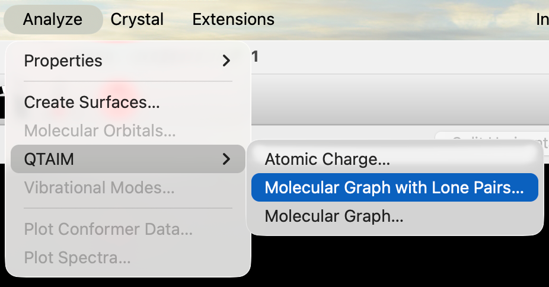
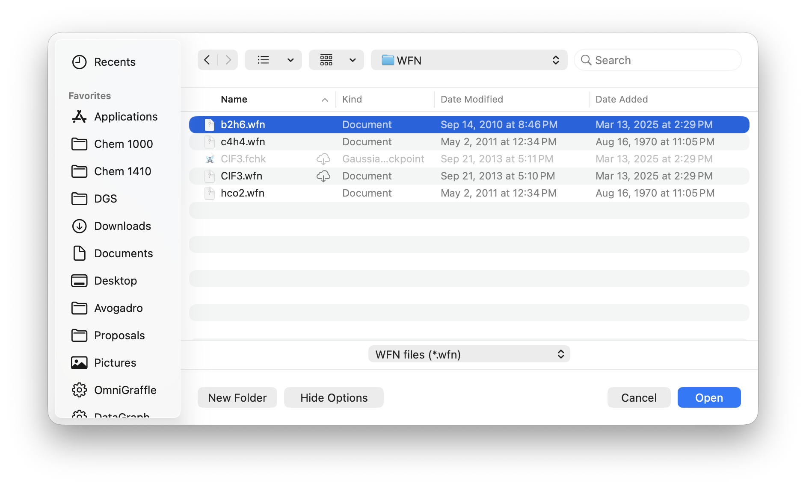
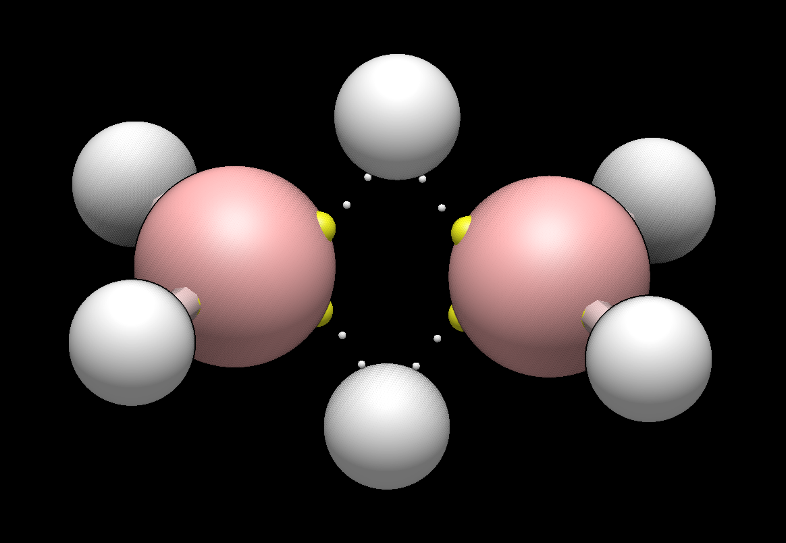
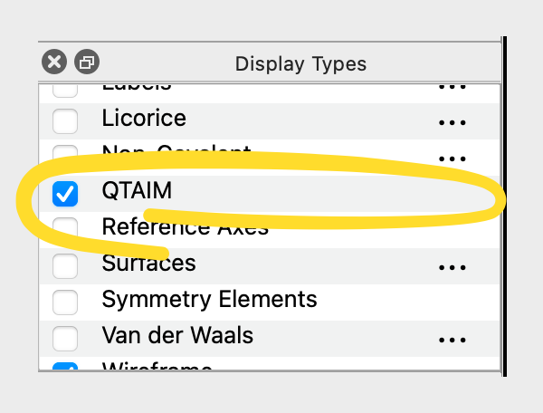
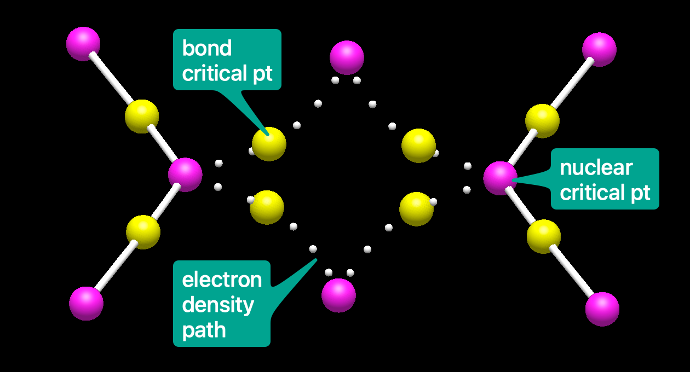

(qtaim)=

# Using QTAIM (Atoms in Molecules) Analysis

Avogadro includes support for the QTAIM analysis developed by Prof. Richard Bader and his group. This technique allows Avogadro to determine bond connections and bond orders directly from the quantum mechanical electron density.

## Start with a WFN File

Most quantum chemistry software allows creating a WFN format file from the output of a calculation. We can read this file in through the QTAIM menu items for visualization and analysis. In the future, other formats will also be supported, including deriving the data directly from other formats.

Here we've picked a WFN file of interest (`b2h6.wfn`) using the Molecular Graph + Lone Pairs command.

Avogadro's QTAIM support will read in the atoms, determine bonds and bond orders using AIM analysis and then continue with further analysis.

Initially, you may not see anything different. QTAIM includes a separate Display Type for viewing the results of the AIM analysis.

Here, we've enabled the QTAIM display, which will show lone pairs, bond critical points, etc. You may also want to turn off the Ball and Stick model to see all AIM annotations.

Here, we've also turned off the classical ball and stick display type to leave only the QTAIM view of $\ce{HCO2}$.

- **magenta** - atom critical points
- **yellow** - bond critical points
- **dashed lines** - weak interaction paths
- **solid lines** - covalent interaction paths
