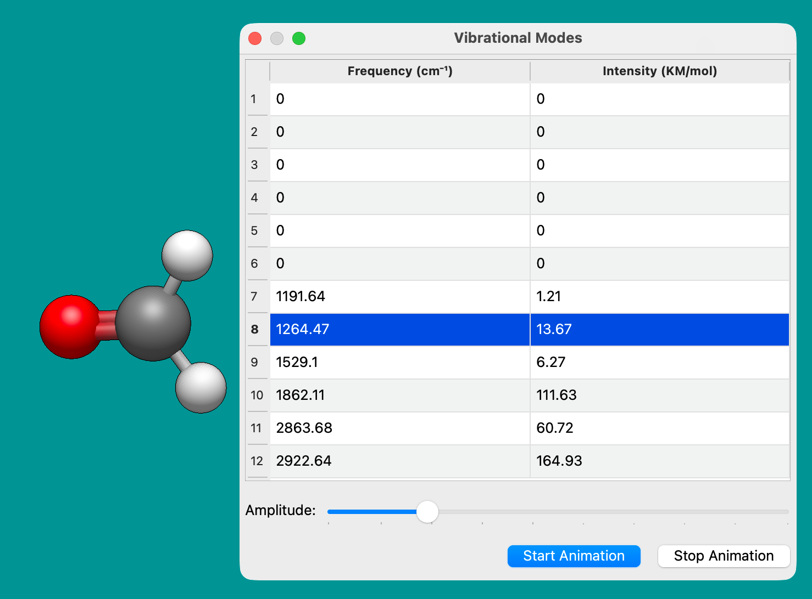
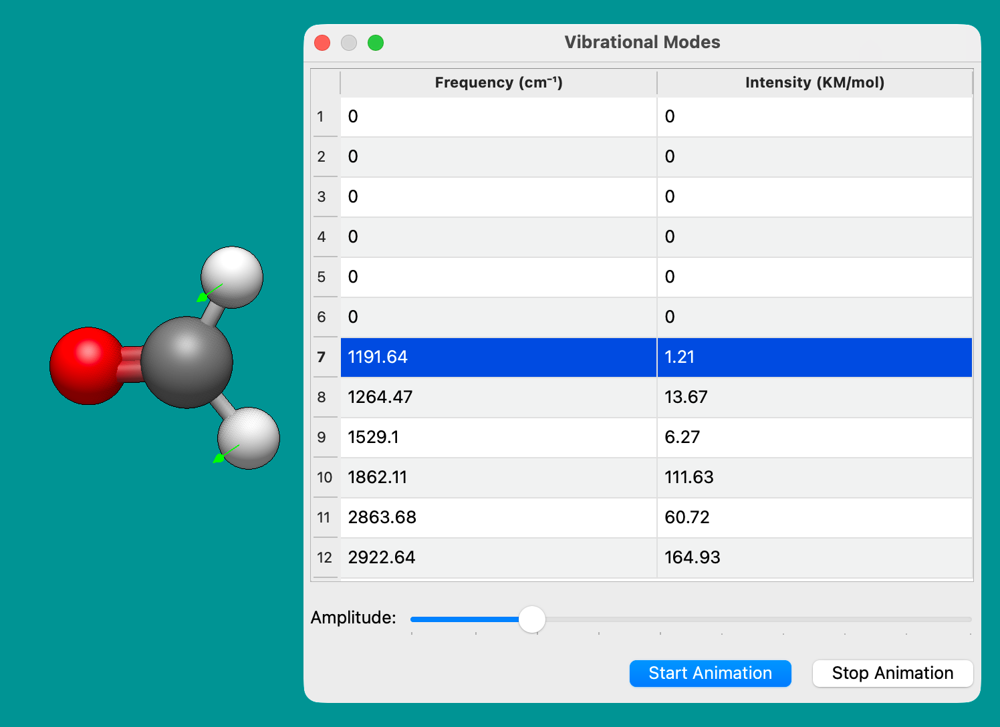
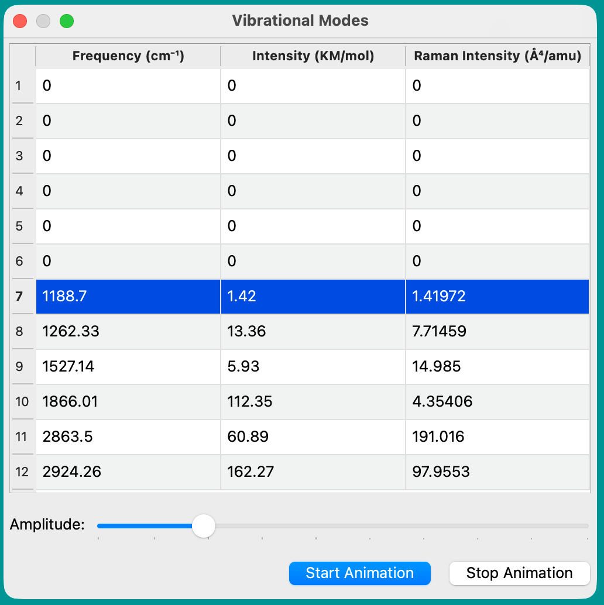

(tutorials-viewing-vibrations)=

# Viewing Vibrations

This feature allows visualizing vibrations from a "frequency" calculation with quantum chemistry codes \(e.g., Gaussian, ORCA, Q-Chem, etc.\)

After opening a corresponding output file, the "Vibrations" window will automatically open.

In some cases, programs will include negative (imaginary) frequencies, or zero frequencies for the translational and rotational motion.

This toolbar allows you to view the various vibrations of a molecule. Selecting a frequency, and clicking "Start Animation" will begin a vibration.

Avogadro then provides you with the ability to tune the vibration amplitude, it allows you to display the force vectors on the atoms present.

If the calculation included Raman intensities, the window will also show those.

