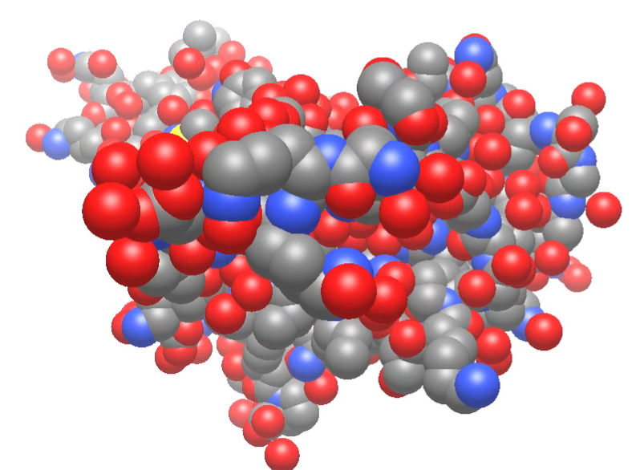

# Major New Features

### Speed and stability

A major concern with Avogadro 1.x was speed when handling larger systems including biomolecules (protein, DNA/RNA) and materials. Even viewing and rotating large molecules would be slow, much less editing them or performing optimizations or dynamics calculations.

We also know that Avogadro 1.x crashed for multiple reasons – not least because we used older rendering code which was not well-supported by modern graphics cards and drivers.

Avogadro 2.0 has been rewritten from the ground up. **Avogadro v2 was designed for fast modern rendering and improved stability. It is a platform to make it easy to build the next generation of molecular and materials visualization and editing tools.**

### Rendering

Avogadro's new rendering framework _**easily**_ handles tens and hundreds of thousands of atoms – not just because hardware has improved but by using new 3D graphics rendering methods which make better use of modern GPUs.

<figure><figcaption>
Example of real-time shadows and depth effects on COVID spike protein (PDB: 6vxx) – around 25,000 atoms
</figcaption></figure>

#### New real-time shadows and depth effects

The new rendering system not only handles more atoms, but real-time shadows (also called ambient occlusion) provide depth effects which make even smaller molecules look more like physical models.

<figure><figcaption>
Ball-and-stick model of a caffeine molecule showing real-time shading
</figcaption></figure>

#### DEPTH-BLUR

The new rendering system not only handles more atoms, but real-time **depth-blur** provides **depth effects** which make even the **structure of the molecules** look more three-dimensional. Depth-blur is used to enhance the visibility of the *depth* of molecules, making their spatial arrangement and **depth** more apparent. After applying depth-blur, the **depth** and **relative positioning** of the molecular structures should be clearly visible, enhancing the overall visual clarity and aiding in a better understanding of the molecule's geometry.

<figure><figcaption>
illustration of depth-blur
</figcaption></figure>

#### FOG

The new rendering system not only handles more atoms, but real-time **fog** effects enhance the depth perception within molecules. **Fog** is used to simulate atmospheric conditions within the molecular environment, making the spatial arrangement and **depth** more perceptible. By applying **fog**, the **depth** and **relative positioning** of molecular structures become clearer, improving the overall visual clarity and aiding in a better understanding of the molecule's geometry.

<figure><figcaption>
illustration of FOG
</figcaption></figure>

#### New "close-contact" rendering

This new rendering type visualizes various types of non-bonded close-contact interactions, including salt bridge and repulsive electrostatic interactions.

<figure><figcaption>
Close-contact interactions as grey dashed lines
</figcaption></figure>

#### New non-bonded rendering analysis, including hydrogen bonds, halogen bonds, and chalcogen bonds

Another new rendering type highlights hydrogen bonds, halogen and chalcogen non-bonded interactions.

<figure><figcaption>
DNA bases highlighting hydrogen bonding interactions
</figcaption></figure>

#### New cartoon/ribbon styles for proteins

<figure><figcaption>
Example ribbon/cartoon view of COVID spike protein (PDB: 6vxx)
</figcaption></figure>

### Layers

A major new feature in Avogadro 2 is the layer system, similar to that found in graphics editing software. You can create new layers for a wide variety of tasks:

* to hide part of the molecule (e.g., put solvent into one layer and hide it during analysis or editing)
* to use multiple rendering options (e.g., display a protein with cartoon, but show a few key residues with ball-and-stick rendering)
* to lock a layer to prevent editing (e.g., moving a molecule to bind with a locked surface or protein active site)

A new section on the Layer dock and tutorials on using layers for common tasks is available in this manual.

Future development will enable the use layers for complex simulations (e.g., QM/MM with one layer defining the quantum chemical fragments).

### Symmetry properties

Avogadro 2 includes a new tool to perceive molecular symmetry, display symmetry elements, and explore subgroups and classes of symmetric atoms. You can find it under `Analysis`⇒`Properties`⇒`Symmetry…`.

<figure><figcaption>
Example of symmetry detection and rendering on a C60 molecule, showing the inversion center and C5 rotations
</figcaption></figure>

### Template tool

A new Template tool makes it easy to rapidly build inorganic/organometallic complexes with different geometries and ligands.&#x20;

<figure><figcaption>
Example of the use of the Template tool to insert an octahedral iron fragment
</figcaption></figure>

The feature also works well for adding functional groups like phenyl rings to existing molecules on a simple click, or a wide range of other fragments.

<figure><figcaption>
Example of ligand insertion with the Template tool, including bidentate ligands such as acac
</figcaption></figure>

### Solvent-accessible and solvent-excluded surfaces

In addition to the [molecular van der Waals surface](https://en.wikipedia.org/wiki/Van_der_Waals_surface), Avogadro can now compute and visualize the [solvent-accessible](https://en.wikipedia.org/wiki/Accessible_surface_area) and solvent-excluded surface areas.

The **solvent-accessible** surface is generated by rolling a sphere representing the solvent (e.g., radius 1.4 Å for water) over the molecule. Consequently, it is 1.4 Å further out than the van der Waals surface.

<figure><figcaption>
Example of the solvent-<strong>accessible</strong> surface with electrostatic potential for an aspirin molecule.
</figcaption></figure>

The **solvent-excluded** surface represents areas the solvation sphere cannot access. That is, it cannot reach into gaps or corners, but rolls over the van der Waals atom spheres exactly.

<figure><figcaption>
Example of the solvent-<strong>excluded</strong> surface with electrostatic potential for an aspirin molecule.
</figcaption></figure>

### Flexible electrostatics models

Since there are many ways to approximate electrostatics in molecules, including atomic partial charges, there is a new framework for assigning electrostatics. By default, Avogadro includes several partial charge models from Open Babel, including Gasteiger charges, EEM, and MMFF94 methods.

If installed and available in your command path, `xtb` (GFN2) and `antechamber` (AM1BCC) charges can also be assigned using Python scripts.

The framework allows installing additional Python scripts, which could assign atomic partial charges or electrostatic potential surfaces using other programs, ML models, etc.

<figure><figcaption>
Example molecule with EEM atom colors (red = negative, blue = positive)
</figcaption></figure>

### New analysis tools

* Plot theoretical x-ray diffraction patterns for crystals

* Plot pair distribution functions

* Band structure diagrams with Yaehmop `eht_bind`

### Python commands and extensions

With Avogadro 2, it's easier than ever to create a quick Python script and add it as an Avogadro command. These scripts could for example modify the molecule/atoms (e.g., add a solvent box), run analysis (e.g., assign R and S stereochemical labels with `rdkit`), optimize the geometry, create nanoparticles or nanotubes using installed Python modules (e.g., `pymatgen` or `ASE`), generate ice crystal structures, solvate molecules, and many more.

Current extension types include:

* input file generators
* file format translators
* additional menu commands
* force fields
* electrostatics models
* data (e.g., molecule and crystal fragments)

More information can be found in the section on [Extensions and Python](extensions).

You can also share your extensions through GitHub and others can then download and install or update to new versions through the "Download Extensions" dialog:

<figure><figcaption>
Download Python extension scripts for menu commands, input generators, file formats and more
</figcaption></figure>

### Python scripting and Jupyter integration

* Python module (including Jupyter support) to load files, calculate orbitals, etc.
* Automate common tasks (e.g., load files, save graphics, animations)

### New and updated interfaces to external programs

* PySCF, Psi4, CP2k, APBS, LAMMPS, OpenMM
* Most interfaces use Python scripts to easily edit defaults and options
