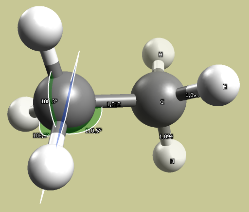

# Organic Hybridization

Illustrate the geometry and bond lengths in sp3, sp2 and sp hybridized carbons.

## Task

For each of ethane, ethylene and ethyne, build the molecule and optimize the geometry. Use the measurement tool to examine bond lengths and bond angles.

## Solution

Results using the MMFF94 forcefield:

- sp3 - ethane bond angle: 110°; C-C bond length: 1.5 Å.
- sp2 - ethylene bond angle: 121°; C-C bond length: 1.336 Å.
- sp - ethyne bond angle: 180°; C-C bond length: 1.200 Å.

## See also

[Basic VSEPR](basic_vsepr)

## Further reading

[Orbital hybridization (wikipedia)](https://en.wikipedia.org/wiki/Orbital_hybridisation)
